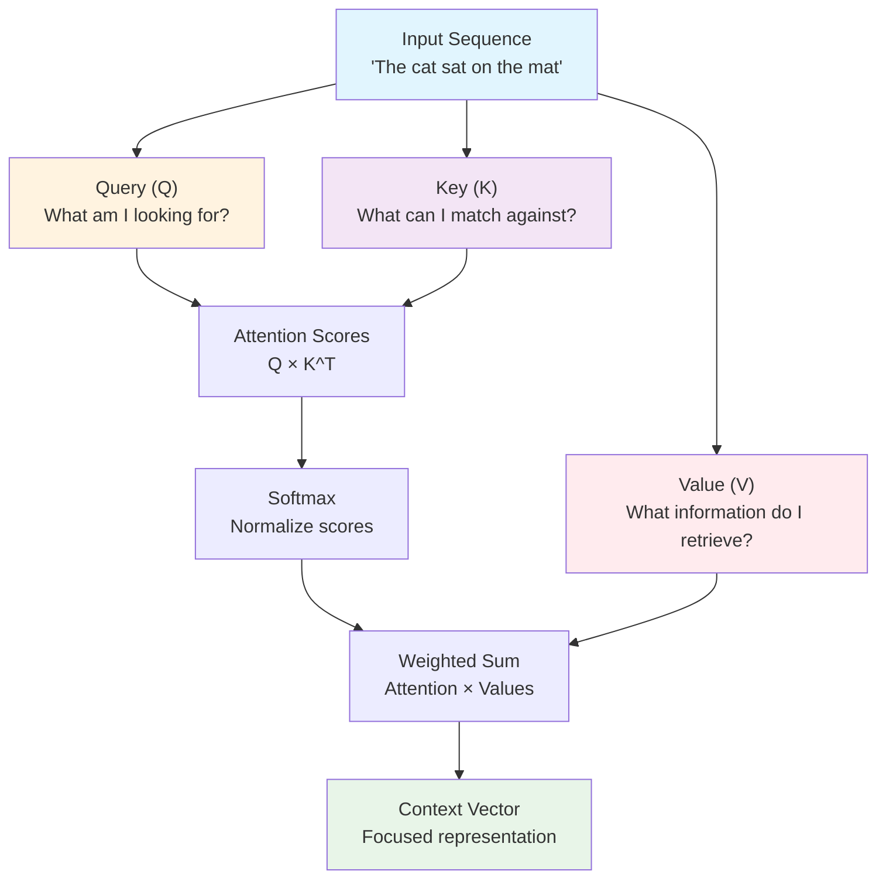
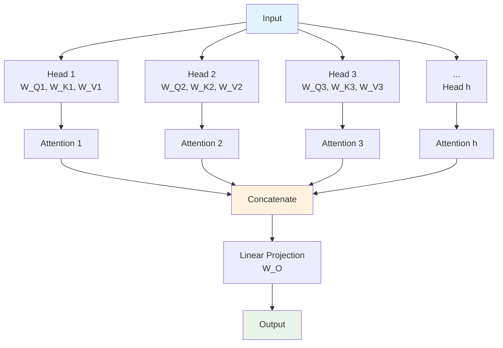

# Attention Mechanism Explained

This document explains the attention mechanism, the core innovation that powers modern transformer-based language models.

## Overview

Attention is a mechanism that allows neural networks to focus on different parts of the input when producing each part of the output. It solves the information bottleneck problem of traditional sequence models.

## The Attention Concept



## Mathematical Foundation

### **Basic Attention Formula**
```
Attention(Q, K, V) = softmax(QK^T / √d_k)V

Where:
- Q: Query matrix [seq_len × d_k]
- K: Key matrix [seq_len × d_k] 
- V: Value matrix [seq_len × d_v]
- d_k: dimension of keys (for scaling)
```

### **Step-by-Step Calculation**
1. **Compute Scores**: `scores = Q × K^T`
2. **Scale**: `scaled_scores = scores / √d_k`
3. **Normalize**: `weights = softmax(scaled_scores)`
4. **Weighted Sum**: `output = weights × V`

## Self-Attention

### **Concept**
- Query, Key, and Value all come from the same input
- Each position can attend to all positions in the sequence
- Captures relationships within the sequence

### **Example**
```
Input: "The cat sat on the mat"

When processing "sat":
- High attention to "cat" (subject)
- Medium attention to "mat" (object)
- Low attention to "the", "on" (less relevant)
```

## Multi-Head Attention

### **Architecture**


### **Benefits**
- **Multiple Perspectives**: Each head learns different relationships
- **Parallel Processing**: All heads computed simultaneously
- **Rich Representations**: Combines different types of attention

### **Mathematical Form**
```
MultiHead(Q, K, V) = Concat(head_1, ..., head_h)W_O

Where head_i = Attention(QW_Qi, KW_Ki, VW_Vi)
```

## Types of Attention Patterns

### **1. Syntactic Attention**
- Focuses on grammatical relationships
- Subject-verb, verb-object connections
- Dependency parsing patterns

### **2. Semantic Attention**
- Captures meaning relationships
- Coreference resolution
- Thematic roles

### **3. Positional Attention**
- Attends to nearby positions
- Local context patterns
- Sequential dependencies

### **4. Global Attention**
- Long-range dependencies
- Document-level relationships
- Cross-sentence connections

## Attention Visualization

### **Attention Weights**
```
Input: "The cat sat on the mat"
Position: "sat" (index 2)

Attention weights:
- "The" (0): 0.05
- "cat" (1): 0.60  ← High attention (subject)
- "sat" (2): 0.15  ← Self-attention
- "on"  (3): 0.05
- "the" (4): 0.05
- "mat" (5): 0.10  ← Medium attention (object)
```

### **Attention Maps**
- Heatmaps showing attention patterns
- Rows: output positions
- Columns: input positions
- Intensity: attention weight

## Causal (Masked) Attention

### **Purpose**
- Prevents looking at future tokens
- Ensures autoregressive generation
- Maintains left-to-right processing

### **Implementation**
```
# Mask future positions
mask = torch.triu(torch.ones(seq_len, seq_len), diagonal=1)
scores = scores.masked_fill(mask == 1, -inf)
weights = softmax(scores)
```

### **Effect**
- Token at position i can only attend to positions ≤ i
- Preserves causal ordering
- Essential for language generation

## Computational Complexity

### **Time Complexity**
- **Attention**: O(n²d) where n = sequence length, d = model dimension
- **Quadratic** in sequence length
- Becomes expensive for long sequences

### **Space Complexity**
- **Attention Matrix**: O(n²) for storing attention weights
- **Memory bottleneck** for long sequences
- Limits maximum context length

## Optimization Techniques

### **1. Sparse Attention**
- Only attend to subset of positions
- Reduces complexity to O(n√n) or O(n log n)
- Examples: Longformer, BigBird

### **2. Linear Attention**
- Approximate attention with linear complexity
- Kernel methods and low-rank approximations
- Trade-off between efficiency and quality

### **3. Flash Attention**
- Memory-efficient attention computation
- Reduces memory usage without approximation
- Enables longer sequences

## Key Properties

### **1. Permutation Invariance**
- Attention is invariant to input order
- Requires positional encoding
- Flexible but needs explicit position info

### **2. Differentiability**
- Fully differentiable mechanism
- Enables end-to-end training
- Gradients flow through attention weights

### **3. Interpretability**
- Attention weights are interpretable
- Can visualize what model focuses on
- Helps understand model behavior

## Applications Beyond Language

### **Computer Vision**
- Vision Transformer (ViT)
- Self-attention for image patches
- Object detection and segmentation

### **Speech Processing**
- Speech recognition and synthesis
- Audio sequence modeling
- Music generation

### **Multimodal Models**
- Cross-attention between modalities
- Image captioning, VQA
- Text-to-image generation

## Historical Context

### **Before Attention**
- RNNs with fixed-size hidden states
- Information bottleneck problem
- Sequential processing limitations

### **Attention Introduction**
- First used in machine translation
- Bahdanau et al. (2014), Luong et al. (2015)
- Encoder-decoder attention

### **Self-Attention Revolution**
- "Attention Is All You Need" (2017)
- Transformer architecture
- Replaced recurrence entirely

## Common Misconceptions

### **1. "Attention = Focus"**
- Attention distributes, doesn't just focus
- Can attend to multiple positions
- Weighted combination, not selection

### **2. "Higher Weight = More Important"**
- Context-dependent importance
- Multiple heads capture different aspects
- Interpretation requires care

### **3. "Attention Explains Decisions"**
- Correlation vs. causation
- Attention ≠ explanation
- Useful but not complete picture
