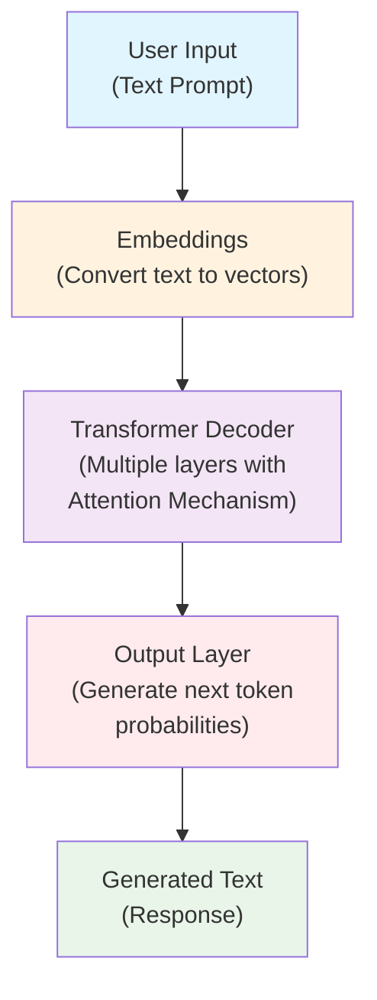

# ChatGPT Architecture Overview

This document provides a high-level overview of how ChatGPT works, focusing on the key architectural components.

## High-Level Architecture



## Key Components

### 1. **Embeddings**
- Convert input tokens into dense vector representations
- Capture semantic meaning of words and subwords
- Learned during training to encode linguistic relationships

### 2. **Transformer Decoder Architecture**
- Stack of identical decoder layers (typically 96+ layers in GPT-3.5/4)
- Each layer contains self-attention and feed-forward components
- Processes sequences autoregressively (left-to-right)

### 3. **Attention Mechanism**
- **Self-Attention**: Allows model to focus on different parts of the input sequence
- **Multi-Head Attention**: Multiple attention mechanisms running in parallel
- Computes relationships between all tokens in the sequence
- Key innovation enabling long-range dependencies

### 4. **Training Process**
- **Pre-training**: Large-scale unsupervised learning on internet text
- **Fine-tuning**: Supervised fine-tuning on high-quality conversations
- **RLHF**: Reinforcement Learning from Human Feedback for alignment

## How It Generates Text

1. **Input Processing**: User prompt is tokenized and embedded
2. **Context Understanding**: Attention mechanism processes the entire context
3. **Next Token Prediction**: Model predicts probability distribution over vocabulary
4. **Token Selection**: Sample or select the most likely next token
5. **Iterative Generation**: Repeat process until completion token or max length

## Key Innovations

- **Transformer Architecture**: Enables parallel processing and long-range dependencies
- **Scale**: Billions of parameters trained on massive datasets
- **Attention Mechanism**: Allows dynamic focus on relevant parts of input
- **Autoregressive Generation**: Generates text one token at a time
- **Human Feedback Training**: Aligns model behavior with human preferences
```
