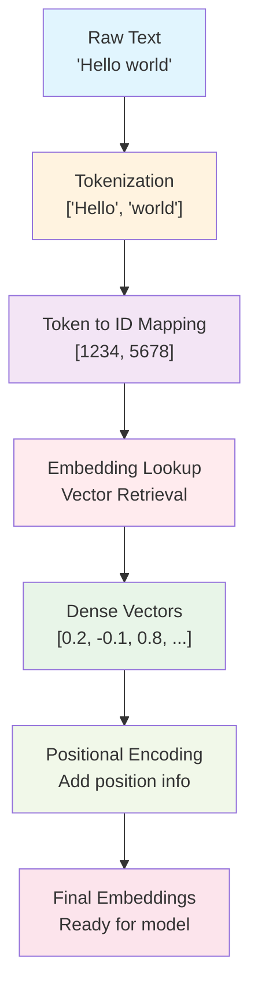

# Text to Vector Conversion: Embeddings Explained

This document explains how text is converted into numerical vectors that machine learning models can process.

## Overview

Text embeddings are dense vector representations of words, subwords, or entire sentences that capture semantic meaning in a numerical format that neural networks can understand.

## The Conversion Process



## Step-by-Step Process

### 1. **Tokenization**
- Break text into smaller units (tokens)
- Modern models use **subword tokenization** (BPE, WordPiece)
- Example: "unhappiness" → ["un", "happy", "ness"]
- Handles out-of-vocabulary words and reduces vocabulary size

### 2. **Token to ID Mapping**
- Each token gets a unique integer ID from vocabulary
- Vocabulary typically contains 50K-100K tokens
- Example: "hello" → 1234, "world" → 5678

### 3. **Embedding Lookup**
- Each token ID maps to a learned dense vector
- Embedding matrix: `[vocab_size × embedding_dim]`
- Common dimensions: 512, 768, 1024, 4096
- Vectors are learned during training

### 4. **Dense Vector Representation**
- Each token becomes a high-dimensional vector
- Example: "hello" → [0.2, -0.1, 0.8, 0.3, -0.5, ...]
- Similar words have similar vectors (cosine similarity)

### 5. **Positional Encoding**
- Add position information to embeddings
- Transformers need to know token order
- Sinusoidal or learned positional embeddings

## Types of Embeddings

### **Word Embeddings**
- One vector per word
- Examples: Word2Vec, GloVe
- Limited by fixed vocabulary

### **Subword Embeddings**
- Vectors for word pieces
- Better handling of rare words
- Used in modern transformers

### **Contextual Embeddings**
- Same word gets different vectors in different contexts
- Generated by transformer models
- Captures polysemy (multiple meanings)

## Mathematical Representation

```
Input text: "The cat sat"
Tokens: ["The", "cat", "sat"]
Token IDs: [1, 15, 23]

Embedding Matrix E: [vocab_size × d_model]
Token embeddings:
- "The" → E[1] = [0.1, 0.3, -0.2, ...]  # d_model dimensions
- "cat" → E[15] = [0.5, -0.1, 0.8, ...]
- "sat" → E[23] = [-0.2, 0.4, 0.1, ...]
```

## Key Properties

### **Semantic Similarity**
- Similar words have similar vectors
- "king" - "man" + "woman" ≈ "queen"
- Measured using cosine similarity

### **Dimensionality**
- Higher dimensions capture more information
- Trade-off between expressiveness and computation
- Typical range: 128 to 4096 dimensions

### **Learned Representations**
- Embeddings are learned during training
- Optimized for the specific task
- Capture patterns from training data

## Training Process

### **Initialization**
- Random initialization of embedding matrix
- Gaussian or uniform distribution

### **Learning**
- Backpropagation updates embedding vectors
- Gradients flow from loss function
- Similar contexts push similar words together

### **Optimization**
- Embeddings optimized for downstream task
- Language modeling objective
- Contrastive learning approaches

## Modern Improvements

### **Subword Tokenization**
- Byte Pair Encoding (BPE)
- WordPiece tokenization
- SentencePiece

### **Contextual Embeddings**
- BERT, GPT, T5 style embeddings
- Different vectors for same word in different contexts
- Capture polysemy and context dependence

### **Multilingual Embeddings**
- Cross-lingual representations
- Shared embedding space across languages
- Enable zero-shot transfer

## Example Code Concept

```python
# Simplified embedding process
def text_to_embeddings(text, tokenizer, embedding_matrix):
    # Step 1: Tokenize
    tokens = tokenizer.tokenize(text)
    
    # Step 2: Convert to IDs
    token_ids = tokenizer.convert_tokens_to_ids(tokens)
    
    # Step 3: Lookup embeddings
    embeddings = embedding_matrix[token_ids]
    
    # Step 4: Add positional encoding
    embeddings += positional_encoding(len(tokens))
    
    return embeddings
```

## Applications

- **Language Models**: GPT, BERT, T5
- **Machine Translation**: Encoder-decoder models
- **Information Retrieval**: Semantic search
- **Recommendation Systems**: Item and user embeddings
- **Computer Vision**: Vision transformers
