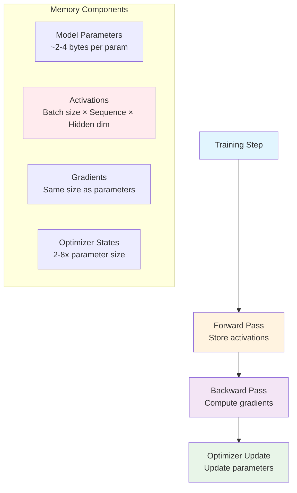
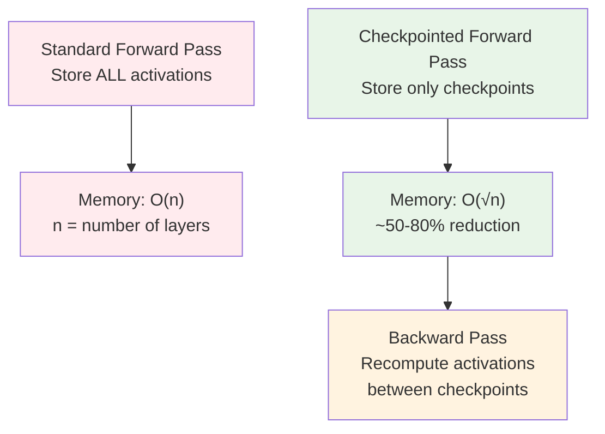
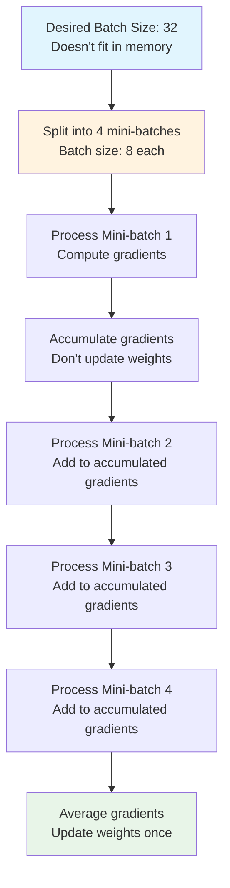
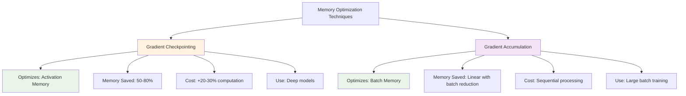

# Gradient Checkpointing vs Gradient Accumulation: Memory Optimization Techniques

This document explains two critical memory optimization techniques used in training large neural networks: gradient checkpointing and gradient accumulation, and how they enable training models that would otherwise exceed available GPU memory.

## Overview

Training large neural networks requires significant GPU memory for:
- **Model parameters**: Weights and biases
- **Activations**: Intermediate layer outputs during forward pass
- **Gradients**: Computed during backpropagation
- **Optimizer states**: Momentum, variance estimates (Adam, etc.)

Gradient checkpointing and gradient accumulation are complementary techniques that reduce memory requirements through different mechanisms, enabling training of models 4-10x larger than would otherwise fit in available memory.

## Understanding Batch Sizes

Before diving into optimization techniques, it's important to understand the different batch size concepts:

### **Mini-batch Size (Local Batch) — Determines Memory Usage**
- The number of samples processed in a single forward/backward pass
- **This is what sits in GPU memory at any one time**
- Limited by GPU memory capacity
- Example: 8 samples per GPU

### **Global Batch Size (Effective Batch Size) — Determines Training Behavior**
- The total number of samples used to compute one weight update
- **This is a conceptual number, NOT about memory**
- Determines training dynamics: convergence, stability, generalization
- Calculated as: `global_batch = mini_batch × accumulation_steps × num_GPUs`

### **Key Distinction: Memory vs. Training Dynamics**

| Concept | What it determines | What's in memory? |
|---------|-------------------|-------------------|
| Mini-batch size | GPU memory usage | ✅ Yes - this is in memory |
| Accumulation steps | How many sequential batches before update | ❌ No - processed one at a time |
| Number of GPUs | Parallel processing | ❌ No - each GPU has its own memory |
| **Global batch size** | **Training behavior** | ❌ No - just a conceptual total |

### **Example: How It Works**

```
Configuration:
  Mini-batch size: 8          ← Only THIS is in GPU memory at once
  Accumulation steps: 4       ← Process 4 batches SEQUENTIALLY
  Number of GPUs: 2           ← Each GPU processes its own batches IN PARALLEL

Memory per GPU: Always just 8 samples (not 64!)

What happens during one weight update:

  GPU 1: [8 samples] → [8 samples] → [8 samples] → [8 samples]  = 32 samples
  GPU 2: [8 samples] → [8 samples] → [8 samples] → [8 samples]  = 32 samples
                              ↓                        ↓
                    (gradients accumulate)    (gradients sync)
                                                       ↓
                                              Weight Update
                                              
  Global batch size = 8 × 4 × 2 = 64 samples contributed to this update
```

### **Why Global Batch Size Matters (Not Memory, But Training)**
- **Training stability**: Larger global batches provide more stable gradient estimates
- **Learning rate scaling**: Larger global batches often allow higher learning rates
- **Convergence**: Some models require specific global batch sizes for optimal training
- **Research reproducibility**: Papers report global batch size, not mini-batch

The goal of memory optimization is to achieve a desired **global batch size** (for good training) while working within **GPU memory constraints** that limit the mini-batch size.

## Memory Usage During Training



## Gradient Checkpointing

### **What is Gradient Checkpointing?**

Gradient checkpointing (also called activation checkpointing) is a memory optimization technique that trades computation time for memory by selectively storing only certain activations during the forward pass, then recomputing missing activations during backpropagation when needed.

### **How It Works**



**Standard Backpropagation:**
1. Forward pass: Compute and **store all activations** for each layer
2. Backward pass: Use stored activations to compute gradients
3. Memory: O(n) where n = number of layers

**With Gradient Checkpointing:**
1. Forward pass: Compute activations but **store only checkpoints** (e.g., every k layers)
2. Backward pass: When gradients need activations between checkpoints, **recompute them**
3. Memory: O(√n) - approximately square root of layers
4. Computation: ~20-30% increase due to recomputation

### **Mathematical Trade-off**

```
Memory Reduction: ~50-80% of activation memory
Computation Increase: ~20-30% additional forward passes
Optimal Checkpoint Strategy: Every √n layers for balanced trade-off
```

### **Implementation Example**

```python
# PyTorch Implementation
import torch
from torch.utils.checkpoint import checkpoint

# Standard approach (high memory)
def forward_standard(x):
    x = layer1(x)  # Activation stored
    x = layer2(x)  # Activation stored
    x = layer3(x)  # Activation stored
    return x

# With gradient checkpointing (low memory)
def forward_checkpointed(x):
    x = checkpoint(layer1, x)  # Checkpoint stored
    x = checkpoint(layer2, x)  # Checkpoint stored
    x = checkpoint(layer3, x)  # Checkpoint stored
    return x

# Automatic checkpointing for entire model
model = torch.nn.Sequential(layer1, layer2, layer3)
output = checkpoint(model, input)
```

### **When to Use Gradient Checkpointing**

- ✅ Training very deep models (50+ layers)
- ✅ Large transformer models (GPT, BERT, T5)
- ✅ Long sequence models (sequence length > 1024)
- ✅ Limited GPU memory but sufficient compute
- ✅ When activation memory is the bottleneck

### **Advantages**
- Significant memory reduction (50-80%)
- Enables training deeper models
- Minimal code changes required
- Works with any architecture

### **Disadvantages**
- Increases computation time (~20-30%)
- Requires recomputation during backprop
- May slow down training iteration time

## Gradient Accumulation

### **What is Gradient Accumulation?**

Gradient accumulation is a technique to simulate larger batch sizes by accumulating gradients over multiple mini-batches before updating model parameters. This allows training with large effective batch sizes even when limited GPU memory prevents processing large batches at once.

### **How It Works**



**Standard Training:**
- Process batch of size 32 → compute gradients → update weights
- Memory: O(32 × sequence_length × hidden_dim)

**With Gradient Accumulation:**
- Process 4 mini-batches of size 8 → accumulate gradients → update weights once
- Memory: O(8 × sequence_length × hidden_dim) = 75% reduction
- Effective batch size: Still 32 (8 × 4)

### **Mathematical Formulation**

```
Standard Training:
  Loss = (1/B) Σ loss(x_i, y_i) for i in batch B
  ∇θ = ∇_θ Loss
  θ ← θ - α∇θ

Gradient Accumulation (N steps):
  ∇θ_accumulated = 0
  For step in range(N):
      Loss_step = (1/b) Σ loss(x_i, y_i) for i in mini-batch b
      ∇θ_step = ∇_θ Loss_step
      ∇θ_accumulated += ∇θ_step / N  # Average gradients
  θ ← θ - α∇θ_accumulated
```

### **Implementation Example**

```python
# PyTorch Implementation
optimizer = torch.optim.Adam(model.parameters(), lr=1e-4)
accumulation_steps = 4
effective_batch_size = batch_size * accumulation_steps

optimizer.zero_grad()  # Initialize gradients

for i, (inputs, targets) in enumerate(dataloader):
    # Forward pass
    outputs = model(inputs)
    loss = criterion(outputs, targets)
    
    # Normalize loss by accumulation steps
    loss = loss / accumulation_steps
    
    # Backward pass (accumulates gradients)
    loss.backward()
    
    # Update weights every N steps
    if (i + 1) % accumulation_steps == 0:
        optimizer.step()  # Update parameters
        optimizer.zero_grad()  # Reset gradients
```

### **When to Use Gradient Accumulation**

- ✅ Need large batch sizes for training stability
- ✅ Limited GPU memory prevents desired batch size
- ✅ Want to maintain large effective batch size
- ✅ Distributed training with small per-GPU batches
- ✅ Fine-tuning large models on limited hardware

### **Advantages**
- Linear memory reduction with batch size
- Maintains large effective batch size
- No additional computation overhead
- Easy to implement
- Works with any optimizer

### **Disadvantages**
- Training takes longer (sequential processing)
- Slightly more complex training loop
- Need to track accumulation steps

## Key Differences



| Aspect | Gradient Checkpointing | Gradient Accumulation |
|--------|----------------------|---------------------|
| **What it optimizes** | Activation memory during backprop | Batch processing memory during forward pass |
| **Memory component** | Intermediate layer outputs | Batch size × sequence × hidden dimensions |
| **Memory reduction** | 50-80% of activation memory | Linear with batch size reduction |
| **Computation cost** | +20-30% (recomputation) | Same (just sequential) |
| **Training speed** | Slower iterations | Same iterations, more steps per epoch |
| **Use case** | Deep models, long sequences | Large batch sizes needed |
| **Compatibility** | Works with any architecture | Works with any architecture |
| **Code complexity** | Minimal (wrapper function) | Moderate (loop management) |

## Combining Both Techniques

For maximum memory savings, you can combine both techniques:

```python
from torch.utils.checkpoint import checkpoint

# Configuration
accumulation_steps = 4
batch_size = 8  # Small batch size
effective_batch_size = batch_size * accumulation_steps

optimizer = torch.optim.Adam(model.parameters(), lr=1e-4)
optimizer.zero_grad()

for i, (inputs, targets) in enumerate(dataloader):
    # Use checkpointing for forward pass (saves activation memory)
    outputs = checkpoint(model, inputs)  # Recomputation enabled
    
    # Compute loss and normalize
    loss = criterion(outputs, targets) / accumulation_steps
    
    # Backward pass (accumulates gradients)
    loss.backward()
    
    # Update weights every N steps
    if (i + 1) % accumulation_steps == 0:
        optimizer.step()
        optimizer.zero_grad()
```

**Combined Benefits:**
- **Activation memory**: Reduced by 50-80% (checkpointing)
- **Batch memory**: Reduced by 75% (4x smaller batches)
- **Total memory**: Can enable training models 4-10x larger
- **Trade-off**: ~20-30% slower training due to recomputation

## Memory Reduction Examples

### **Example 1: Training GPT-2 (1.5B parameters)**

**Without optimization:**
- Batch size: 32, Sequence length: 1024
- Activation memory: ~40 GB
- Total memory: ~60 GB
- **Result**: Doesn't fit on single GPU

**With gradient checkpointing:**
- Activation memory: ~12 GB (70% reduction)
- Total memory: ~32 GB
- **Result**: Fits on high-end GPU

**With both techniques:**
- Batch size: 8, Accumulation: 4 steps
- Activation memory: ~12 GB (checkpointing)
- Batch memory: ~10 GB (75% reduction)
- Total memory: ~22 GB
- **Result**: Fits on consumer GPU

### **Example 2: Training BERT-Large**

**Standard training:**
- Batch size: 16, Sequence: 512
- Memory required: ~24 GB

**With gradient accumulation:**
- Batch size: 4, Accumulation: 4 steps
- Memory required: ~8 GB
- Effective batch size: Still 16

**With checkpointing + accumulation:**
- Batch size: 4, Accumulation: 4 steps, Checkpointing: enabled
- Memory required: ~5 GB
- **Result**: Can train on mid-range GPU

## Best Practices

### **Gradient Checkpointing**

1. **Checkpoint Strategy:**
   - Checkpoint every √n layers for balanced trade-off
   - More checkpoints = more memory, less recomputation
   - Fewer checkpoints = less memory, more recomputation

2. **When to Enable:**
   - Enable when hitting OOM (Out of Memory) errors
   - Particularly effective for transformer models
   - Less effective for shallow networks (< 10 layers)

3. **Performance Tips:**
   - Use with mixed precision training
   - Combine with model parallelism for very large models
   - Profile to find optimal checkpoint frequency

### **Gradient Accumulation**

1. **Accumulation Steps:**
   - Choose based on desired effective batch size
   - Common values: 2, 4, 8, 16
   - Too many steps can slow training significantly

2. **Loss Normalization:**
   - Always divide loss by accumulation_steps
   - Ensures gradients are properly averaged
   - Critical for correct training dynamics

3. **Learning Rate:**
   - May need to adjust learning rate with effective batch size
   - Larger effective batch size → can use higher learning rate
   - Follow linear scaling rule: LR ∝ batch_size

### **Combined Usage**

1. **Start with gradient accumulation** if batch size is the issue
2. **Add checkpointing** if still hitting memory limits
3. **Monitor training speed** - balance memory vs. time
4. **Use mixed precision** to further reduce memory
5. **Consider distributed training** for very large models

## Real-World Applications

### **Large Language Models**
- GPT-3, GPT-4: Both techniques essential
- Enables training on consumer hardware
- Critical for fine-tuning large models

### **Vision Transformers**
- ViT, Swin Transformer: Checkpointing crucial
- Large image patches require memory optimization
- Accumulation for large batch training

### **Multimodal Models**
- CLIP, DALL-E: Combined techniques
- Process images and text simultaneously
- Memory-intensive architectures

## Summary

**Gradient Checkpointing:**
- Reduces activation memory by 50-80%
- Trades computation for memory
- Essential for deep models and long sequences
- Best for: Transformer models, deep CNNs

**Gradient Accumulation:**
- Reduces batch processing memory linearly
- Maintains large effective batch sizes
- No computation overhead
- Best for: Large batch training, limited GPU memory

**Together:**
- Enable training models 4-10x larger
- Essential for modern large-scale training
- Balance between memory, computation, and training speed
- Critical tools for training on consumer hardware

Both techniques are fundamental to modern deep learning, enabling researchers and practitioners to train state-of-the-art models on accessible hardware.

