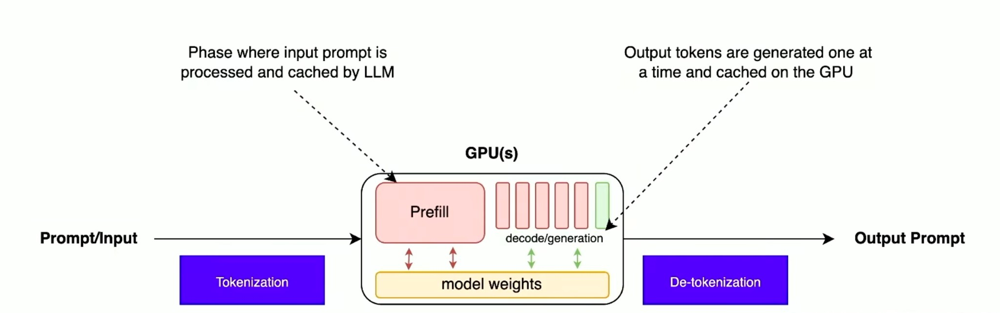
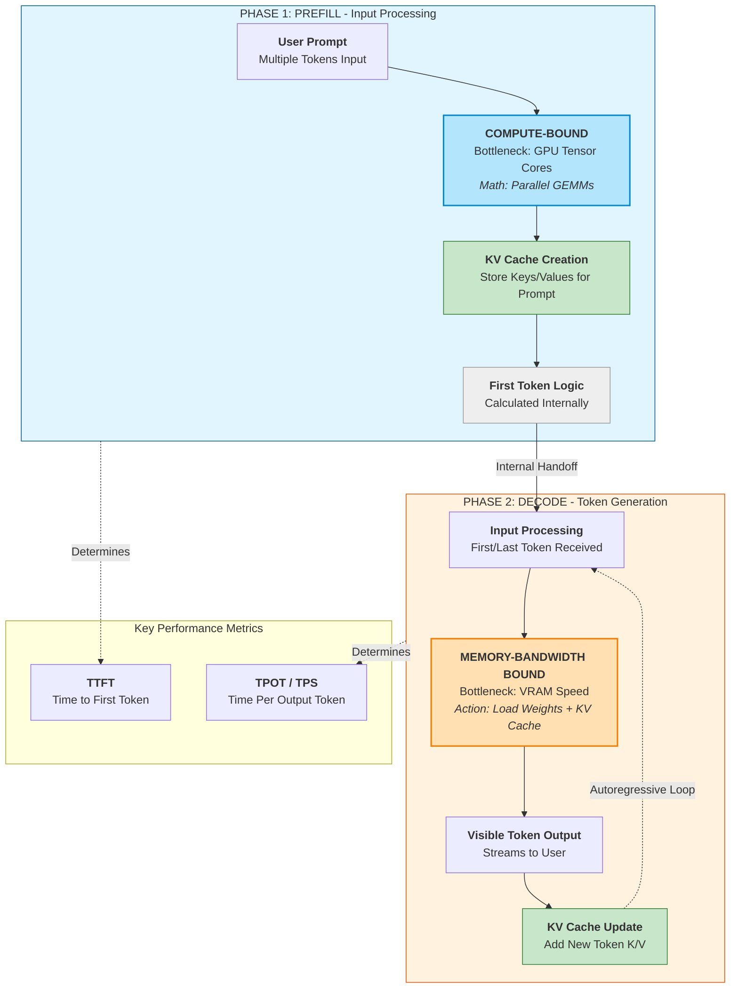
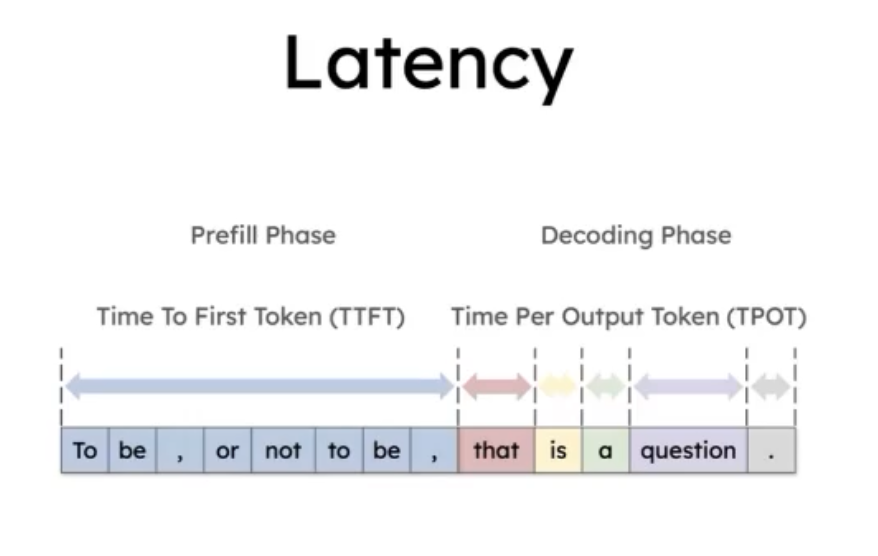
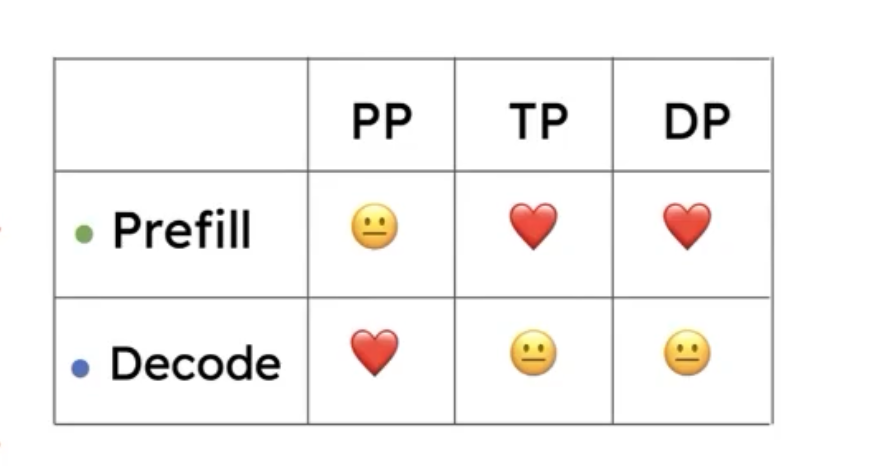

# Inference End-to-End Pipeline

End-to-end flow for LLM inference from prompt to output.

---

## LLM Inference: Prefill vs. Decode

Two distinct phases of LLM inference: **Prefill** (input processing, KV cache creation) and **Decode** (token generation). Each phase has a different hardware bottleneck and drives different performance metrics.

---

## Breakdown of the Phases

| Feature | Phase 1: Prefill | Phase 2: Decode |
|--------|-------------------|------------------|
| **Input** | The entire user prompt (many tokens). | A single token (received from internal handoff or previous loop). |
| **Processing** | All prompt tokens are processed simultaneously. | Tokens are generated one by one (autoregressive). |
| **Primary goal** | Understand context, build KV cache, and trigger generation. | Predict tokens and output visible text to the user. |
| **Bottleneck** | **Compute-bound:** GPU is busy doing heavy math (matrix multiplications). | **Memory-bound:** GPU spends more time moving data from VRAM than doing math. |
| **Key metric** | **TTFT** (Time to First Token): time until the first output of the decode phase appears. | **TPS** (Tokens Per Second): how fast the text “streams” to the screen. |

---

## Understanding the Latency Split

- **Time to First Token (TTFT):** The prefill phase runs entirely “behind the scenes.” The user only sees output once prefill completes and hands off to the first step of the decode phase. **Longer prompts increase this “invisible” processing time.** TTFT is the main latency users feel before any text appears.

- **Time Per Output Token (TPOT):** This is the visible “typing” phase. Once decode begins, it emits tokens one by one. Each step must load model weights and the KV cache, so this phase is limited by **how fast the GPU can move data (bandwidth)**, not by how fast it can do math.

---

## Parallelism Strategies per Phase

Different [parallelism strategies](parallelism.md) benefit each phase differently:

| | [PP](parallelism.md#pipeline-parallelism-pp) | [TP](parallelism.md#tensor-parallelism-tp) | [DP](parallelism.md#fsdp-fully-sharded-data-parallel) |
|---|:---:|:---:|:---:|
| **Prefill** (compute-bound) | Neutral | Great | Great |
| **Decode** (memory-bound) | Great | Neutral | Neutral |

- **Prefill is compute-bound** — it processes the entire prompt in parallel. **TP** splits the matrix math across GPUs so each does less work, directly reducing TTFT. **DP** runs independent requests on separate replicas, boosting throughput. PP adds pipeline latency without helping the heavy compute.
- **Decode is memory-bandwidth-bound** — each token step loads weights and KV cache. **PP** shards the model by layers so each GPU holds fewer weights in memory, reducing the data movement bottleneck. TP and DP don't directly ease the per-token memory bandwidth pressure.

> See [Parallelism Strategies for Large Models](parallelism.md) for full definitions of PP, TP, and DP/FSDP.

---

## Why is the KV Cache so important?

Without the KV cache, the model would have to **re-process the entire prompt** (redo prefill) for every new token it generates. By saving the intermediate states (Keys and Values) during prefill, the model only needs to compute the math for the **newest token** and look up the rest in the cache. That makes decode much cheaper and keeps token-by-token generation feasible.
