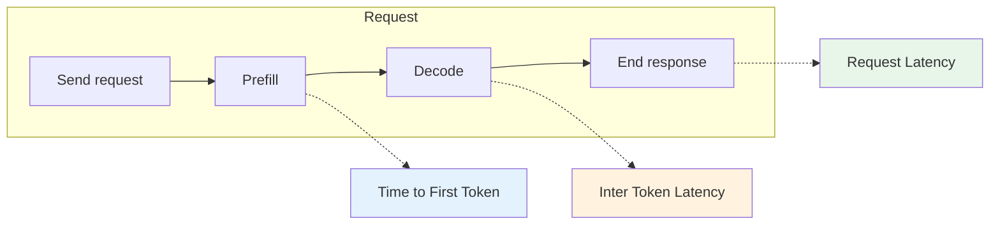
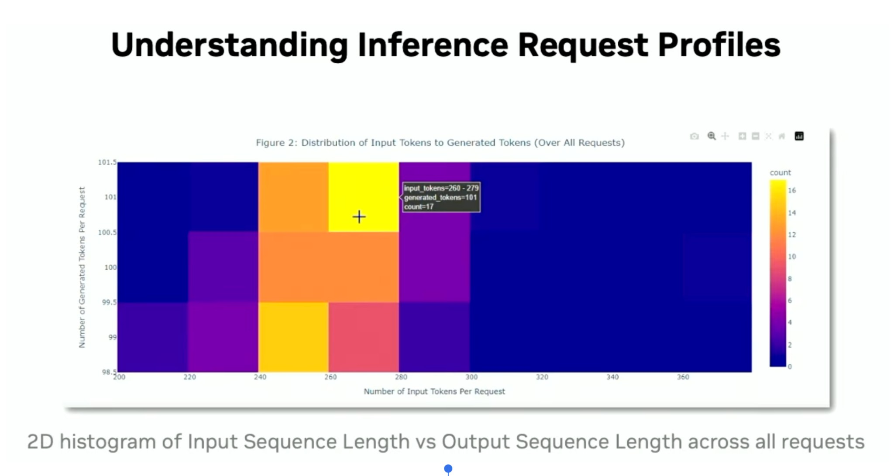
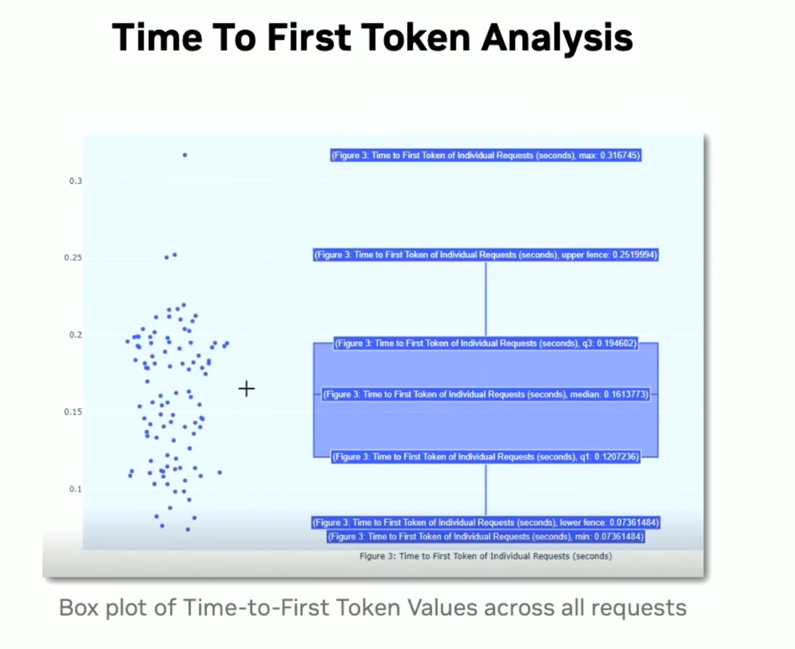
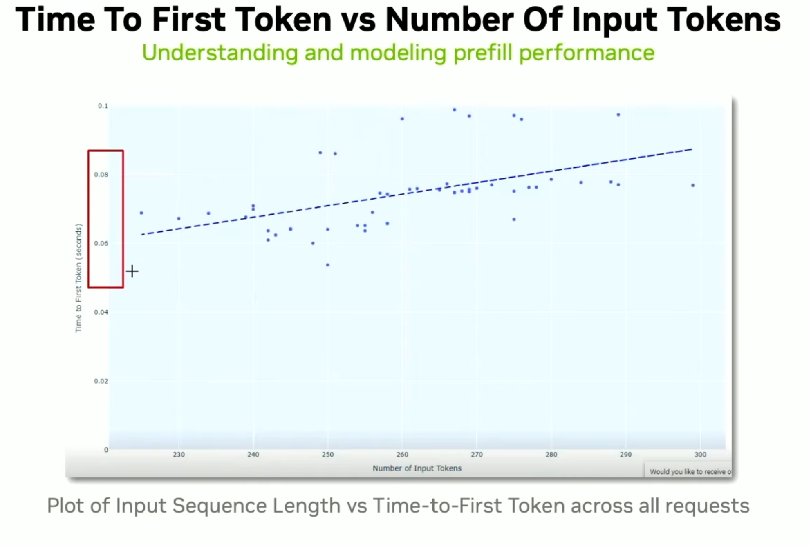

# Inference Performance Metrics

This document covers how to measure and evaluate **LLM inference** performance: latency, throughput, and request profiles. It aligns with the metrics reported by **NVIDIA GenAI-Perf** (Triton Inference Server) and similar tools.

**Primary reference:** [GenAI Performance Analyzer (genai_perf) — NVIDIA Triton Inference Server](https://docs.nvidia.com/deeplearning/triton-inference-server/user-guide/docs/perf_benchmark/genai_perf.html).

---

## Metrics at a glance

Inference has two main phases: **prefill** (process the input prompt, build KV-cache) and **decode** (generate output tokens one-by-one or in chunks). Different metrics emphasize one phase or the whole request.

---

## Reference: GenAI-Perf metrics table

| Metric | Description | Aggregations |
|--------|-------------|--------------|
| **Time to First Token** | Time between when a request is sent and when its first response is received; one value per request. | Avg, min, max, p99, p90, p75 |
| **Inter Token Latency (ITL) / Time Per Output Token (TPOT)** | Time between intermediate responses for a single request, divided by the number of generated tokens of the latter response; one value per response per request. Same as “time per output token” (TPOT). | Avg, min, max, p99, p90, p75 |
| **Request Latency** | Time between when a request is sent and when its final response is received; one value per request. | Avg, min, max, p99, p90, p75 |
| **Output Sequence Length** | Total number of output tokens of a request; one value per request. | Avg, min, max, p99, p90, p75 |
| **Input Sequence Length** | Total number of input tokens of a request; one value per request. | Avg, min, max, p99, p90, p75 |
| **Output Token Throughput** | Total output tokens from benchmark ÷ benchmark duration. | None — one value per benchmark |
| **Request Throughput** | Number of final responses from benchmark ÷ benchmark duration. | None — one value per benchmark |

---

## Time to First Token (TTFT)

**What it is:** Time from sending the request until the **first output token** is received. It includes queuing, **prefill** (processing the full input and filling the KV-cache), and any network or serialization overhead.

**Why it matters:** Users perceive TTFT as “time until something appears.” For interactive use (chat, code completion), low TTFT is critical. TTFT grows with **input length** because prefill must process the entire prompt.

**Aggregations:** Report avg, min, max, p99, p90, p75 across requests. p99 is important for tail latency and user experience.

**Typical influences:** Longer prompts → higher TTFT; higher concurrency → more queuing and often higher TTFT; GPU memory bandwidth and compute for prefill.

---

## Inter Token Latency (ITL) / Time Per Output Token (TPOT)

**What it is:** For a single request, the time between **intermediate responses** (e.g. between streamed chunks), divided by the number of generated tokens in the latter response. GenAI-Perf calls this **Inter Token Latency (ITL)**; the same idea is often reported as **Time Per Output Token (TPOT)** or average ms per token during **decode**. TPS (tokens per second) = 1000 / TPOT (ms).

**Why it matters:** ITL drives how fast the response “streams” after the first token. High ITL means slow token generation; low ITL means high decode throughput per request.

**Aggregations:** Avg, min, max, p99, p90, p75. Per-request ITL can be averaged across requests for a single summary, or you can plot ITL vs. output token position to see decode stability.

**Typical influences:** Decode compute, memory bandwidth for KV-cache, batch size and scheduling across concurrent requests.

---

## Request Latency

**What it is:** **End-to-end** time from sending the request until the **final response** is received (all output tokens delivered). One value per request.

**Why it matters:** Request latency = TTFT + time to generate the rest of the output. It determines “total wait time” for a full response and is often used in SLAs.

**Relationship:** Request Latency ≈ TTFT + (number of generated tokens × effective inter-token time). So it depends on both prefill (TTFT) and decode (ITL, output length).

**Aggregations:** Avg, min, max, p99, p90, p75. p99 is key for tail latency and guarantees.

---

## Output and Input Sequence Length

- **Output Sequence Length:** Total number of **output** (generated) tokens per request. Drives decode cost and request latency.
- **Input Sequence Length:** Total number of **input** (prompt) tokens per request. Drives prefill cost and TTFT.

These are **request characteristics**, not latencies. You report their distribution (avg, min, max, p99, p90, p75) to describe the workload. Plots of **input vs. output length** (e.g. 2D histogram) show the **request profile** of your benchmark and help explain where time is spent.

---

## Output Token Throughput and Request Throughput

- **Output Token Throughput:** Total output tokens produced in the benchmark ÷ total time (e.g. tokens/sec). **One value per benchmark.** Measures system-wide decode capacity.
- **Request Throughput:** Number of **completed requests** ÷ total time (e.g. requests/sec). **One value per benchmark.** Measures how many full requests the system can finish per second.

No per-request aggregations: these are **benchmark-level** metrics. Useful for comparing hardware, batch sizes, or concurrency levels.

---

## Economics and matching human reading speed

These metrics give **economics to the hardware**: they tell you how much throughput or latency you get per dollar and whether it is “good enough” for the use case.

**Matching human reading speed**

Human reading speeds typically range from **200 to 300 words per minute**.

- An **interactivity level of 100** (i.e. 1 / Time per Output Token) means **100 tokens per second**.
- Since ~100 tokens ≈ 75 words, **100 tokens/sec** is about **4,500 words per minute**.
- At that rate, text appears **near-instantaneously** to the human eye.

Pushing for 200 or 300 tokens/sec often gives **diminishing returns** for a single human reader, because they cannot consume the information that fast anyway. So “good enough” streaming for chat or reading is often in the ballpark of tens to low hundreds of tokens per second, depending on the product.

---

## Visualizations and example plots

GenAI-Perf can generate plots with `--generate-plots`. The Triton docs list default plots such as: TTFT analysis, request latency analysis, TTFT vs. input sequence length, inter-token latencies vs. token position, and input vs. output sequence length. Below are example visualizations that match these metrics.

### 1. Request profile: input vs. output tokens

A **2D histogram** of input sequence length vs. generated (output) tokens shows how requests are distributed. It helps you see typical prompt and response lengths and spot clusters (e.g. many requests with ~260–280 input tokens and ~101 generated tokens).

*Distribution of input tokens to generated tokens over all requests. Use this to understand inference workload profiles.*

### 2. Time to First Token analysis

A **box plot** (with optional scatter of individual points) shows the distribution of TTFT across requests: median, quartiles (Q1, Q3), fences, and outliers. Example: median ~0.16 s, Q1 ~0.12 s, Q3 ~0.19 s, with a few requests above 0.25 s.

*Time to First Token of individual requests (seconds). Box: quartiles; points: per-request values.*

### 3. TTFT vs. input sequence length (prefill)

A **scatter plot** of TTFT vs. number of input tokens, optionally with a trend line, shows how **prefill** cost scales with prompt length. Typically TTFT increases as input length increases.

*Time to First Token vs. number of input tokens — understanding and modeling prefill performance.*

---

## Other example plots (from tools and docs)

- **Token timeline:** Token index vs. timestamp per request (staircase: first step = TTFT, slope = ITL). See [NVIDIA NIM LLM Benchmarking — Metrics](https://docs.nvidia.com/nim/benchmarking/llm/latest/metrics.html).
- **ITL vs. output token position:** Line or scatter of inter-token delay vs. position in the sequence (reveals decode stability and variance).
- **TTFT / ITL / Request latency:** Box plots or histograms for different concurrency levels or batch sizes.
- **Throughput vs. concurrency:** Output token throughput (tokens/s) or request throughput (req/s) vs. number of concurrent requests (to find a throughput–latency tradeoff).

**References:**

- [GenAI-Perf — Visualization](https://docs.nvidia.com/deeplearning/triton-inference-server/user-guide/docs/perf_benchmark/genai_perf.html) — `--generate-plots`, `compare` subcommand.
- [Metrics — NVIDIA NIM LLMs Benchmarking](https://docs.nvidia.com/nim/benchmarking/llm/latest/metrics.html) — TTFT, ITL, E2E definitions and timeline.
- [Reproducible performance metrics for LLM inference (Anyscale)](https://anyscale.com/blog/reproducible-performance-metrics-for-llm-inference) — definitions and benchmarking practices.
- [Understand LLM latency and throughput metrics (Anyscale)](https://docs.anyscale.com/llm/serving/benchmarking/metrics) — TTFT, ITL, E2E and what affects them.

---

## Quick reference: what to report

| Goal | Metrics to report |
|------|--------------------|
| Interactive feel (e.g. chat) | TTFT (avg, p99), ITL (avg) |
| Full response time | Request latency (avg, p99) |
| System capacity | Output token throughput, request throughput |
| Workload shape | Input/output sequence length distribution; 2D histogram of input vs. output |
| Prefill behavior | TTFT vs. input length (scatter or binned) |
| Decode behavior | ITL distribution; ITL vs. token position |

Run GenAI-Perf with `--generate-plots` and optional `--profile-export-file` to get CSV/JSON and default plots for further analysis.
