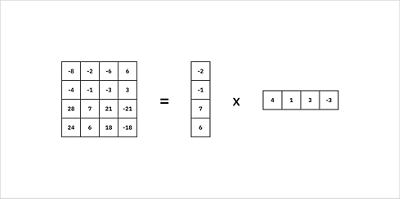
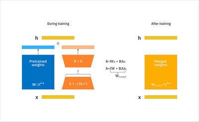
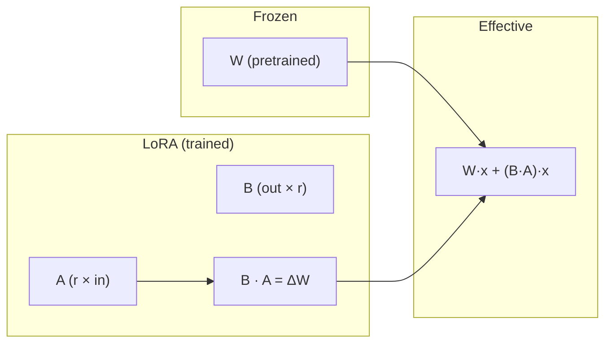

# What is LoRA (Low-Rank Adaptation)?

**LoRA** (Low-Rank Adaptation) is a parameter-efficient fine-tuning method that adapts large models (e.g. LLMs) to new tasks by training only **small low-rank matrices** added on top of the frozen pretrained weights. It reduces compute and memory by avoiding updates to the full weight matrices.

**Main source:** [What is LoRA (Low-Rank Adaption)? | IBM](https://www.ibm.com/think/topics/lora).  
**Original paper:** Hu, Edward, et al., *LoRA: Low-Rank Adaptation of Large Language Models*, 2021.

Diagrams below are from the IBM article (saved in `resources/`).

---

## Key idea

- LoRA **freezes** the original model weights and does **not** modify them.
- It adds a **lightweight low-rank update** (two matrices **A** and **B** of rank **r**) that is trained with gradient descent.
- LoRA focuses on modifying a **smaller subset of parameters** (the low-rank matrices) to reduce **computational and memory overhead**.
- Once training is complete, the small learned matrices can be **merged** into a single new weight matrix for deployment, so there is no extra inference cost.

---

## How LoRA updates weights (without changing the original)

**If we don’t modify the original weights, how do we “update” weights?**

We don’t update the original matrix **W**. We keep **W frozen** and learn an **additive update** (a *delta*):

1. **Original layer:** output = **W** · x (W is frozen).
2. **LoRA adds:** a low-rank product **ΔW = B · A** (A and B are trained).
3. **Effective computation:**  
   output = **W** · x + **ΔW** · x = **W** · x + (**B** · **A**) · x  

So the “updated” behavior comes from **adding** (B·A)·x to the original W·x. The original weights **W** never change; only **A** and **B** are updated during training.

- **During training:** we only compute gradients and update **A** and **B**. **W** is fixed.
- **After training:** we can either:
  - Keep **W** and **(A, B)** separate and add the two terms at runtime, or
  - **Merge** once: **W_new = W + B·A**, and use **W_new** for inference (no change to the original **W** in memory if we replace it by **W_new**).

So “updating weights” in LoRA means: **learning an additive low-rank correction B·A**, not editing the pretrained **W**. The model’s effective weights are **W + B·A** (or the merged **W_new**).

---

## Matrices A and B and rank r

- LoRA represents the **update** to a weight matrix **W** as **ΔW = B · A**:
  - **A**: shape (r × in_features)  
  - **B**: shape (out_features × r)  
  - **r** (rank) is small (e.g. 8, 16, 64).
- So instead of training **W** (which has in_features × out_features parameters), we train only **A** and **B** (r × in_features + out_features × r), which is much smaller when r ≪ min(in_features, out_features).
- A high-rank matrix can be approximated by the product of two low-rank matrices; LoRA assumes the **adaptation** we need has low rank, so a small **r** is enough.

*Source: [IBM Think — LoRA](https://www.ibm.com/think/topics/lora).* A 4×4 matrix decomposed into 4×1 and 1×4 (low-rank factors):

How LoRA updates matrices **A** and **B** (rank r) and merges into a new weight matrix without modifying the original pretrained weights:

---

## Merge after training

Once LoRA training is complete, the small matrices **A** and **B** can be merged into one weight matrix:

- **W_new = W + B · A**
- Then we can save or deploy **W_new** and drop **A** and **B**, so there is **no inference latency** compared to a fully fine-tuned model.

We still do **not** modify the original **W** in the sense of editing the pretrained file; we form a **new** matrix **W_new** that equals W plus the LoRA update. For deployment we can either use **W_new** or keep **W** and apply **(B·A)** at runtime if we want to switch adapters without recomputing the merge.

---

## Advantages

- **Fewer trainable parameters and less memory:** Only **A** and **B** are updated; gradients and optimizer states are not needed for **W**.
- **One base model, many adapters:** The same frozen base can be combined with different **(A, B)** pairs for different tasks.
- **No inference overhead when merged:** After merging to **W_new**, inference is the same as a single linear layer.

---

## Tradeoffs

- **Information loss:** Low-rank decomposition can lose some detail; the effective update **B·A** is a low-rank approximation. For large, overparameterized models this loss is often small.
- **Rank r:** Choosing **r** trades off capacity (higher r, more parameters, more expressivity) vs. efficiency (lower r, fewer parameters, faster and cheaper).

---

## Common parameters (e.g. PEFT / Hugging Face)

- **r**: rank of the update matrices (e.g. 8, 16, 64).
- **target_modules**: which layers get LoRA (e.g. attention projection matrices).
- **lora_alpha**: scaling factor for the LoRA update (often used as a multiplier on **ΔW** when adding to **W**).

---

## Summary

| Concept | Meaning |
|--------|--------|
| Original weights **W** | Frozen; never updated. |
| LoRA update **ΔW** | **B · A**, trained with gradient descent. |
| Effective weights | **W + B·A** (additive); we “update” behavior by adding **ΔW**, not by changing **W**. |
| After training | Can merge to **W_new = W + B·A** for deployment. |

So: **we don’t modify the original weights; we learn an additive low-rank correction (B·A) and add it on top of W.** That is how LoRA “updates” the effective weights without touching the pretrained **W**.
