# Machine Learning Fundamentals

This document covers essential machine learning concepts that every practitioner should understand. Each topic starts with an intuitive explanation and real-world analogy, followed by mathematical formulations and practical guidance.

## Table of Contents

1. [Bias vs Variance Trade-off](#1-bias-vs-variance-trade-off)
2. [Loss Functions](#2-loss-functions)
3. [Learning Rate and Hyperparameter Tuning](#3-learning-rate-and-hyperparameter-tuning)
4. [Weight Initialization](#4-weight-initialization)
5. [Model Evaluation Metrics](#5-model-evaluation-metrics)

---

## 1. Bias vs Variance Trade-off

**Bias** is how wrong your model is on average; **variance** is how inconsistent it is across different datasets. High bias means underfitting, high variance means overfitting. We balance them through model complexity tuning—simpler models have high bias, complex ones have high variance.

For instance, a linear model trying to fit curved data has high bias, while a deep neural network trained too long on small data has high variance.

| | High Bias | Low Bias |
|---|-----------|----------|
| **High Variance** | Worst case: wrong and inconsistent | **Overfitting**: fits noise, unstable |
| **Low Variance** | **Underfitting**: consistently wrong | ✅ **Ideal**: accurate and stable |

### Error Decomposition

In ML, we're trying to learn a function f(x) that predicts y. Our model's error comes from three sources:

```mermaid
graph LR
    A["Total Error"] --> B["Bias²"]
    A --> C["Variance"]
    A --> D["Irreducible Noise"]
    
    B --> B1["Error from wrong assumptions<br/>Model too simple"]
    C --> C1["Error from sensitivity to data<br/>Model too complex"]
    D --> D1["Inherent noise in data<br/>Cannot be reduced"]
```



**Underfitting (High Bias)**:
- Model is too simple to capture the underlying pattern
- Performs poorly on BOTH training and test data
- Example: Linear regression for curved data

**Overfitting (High Variance)**:
- Model memorizes training data including noise
- Performs great on training data, poorly on test data
- Example: Decision tree with no depth limit memorizing every data point

### Mathematical Formulation

For a model's prediction ŷ at point x, the expected prediction error decomposes as:

```
                                    ┌─────────────────┐   ┌─────────────────┐   ┌──────────────────┐
E[(y - ŷ)²]  =  [E(ŷ) - f(x)]²  +  E[(ŷ - E(ŷ))²]  +           σ²
                └───────┬───────┘   └───────┬───────┘   └────────┬─────────┘
                     Bias²              Variance          Irreducible Error
```

| Component | Formula | Interpretation |
|-----------|---------|----------------|
| **Bias²** | [E(ŷ) - f(x)]² | How far off is our *average* prediction from the true function? |
| **Variance** | E[(ŷ - E(ŷ))²] | How much do predictions vary across different training sets? |
| **Irreducible Error** | σ² | Noise inherent in the data — cannot be reduced by any model |

### Calculating Bias and Variance Empirically

In practice, we can estimate bias and variance using **bootstrap resampling**:

```python
import numpy as np
from sklearn.linear_model import LinearRegression

def calculate_bias_variance(model, X_train, y_train, X_test, y_test, n_bootstrap=100):
    """
    Empirical calculation using bootstrap
    Returns: bias^2, variance, total_error
    """
    predictions = []
    
    # 1. Generate multiple models on bootstrap samples
    for _ in range(n_bootstrap):
        # Bootstrap sample
        idx = np.random.choice(len(X_train), len(X_train), replace=True)
        X_boot = X_train[idx]
        y_boot = y_train[idx]
        
        # Train model
        model.fit(X_boot, y_boot)
        
        # Predict on test set
        y_pred = model.predict(X_test)
        predictions.append(y_pred)
    
    predictions = np.array(predictions)  # shape: (n_bootstrap, n_test_samples)
    
    # 2. Calculate for each test point
    avg_prediction = np.mean(predictions, axis=0)
    
    # Bias^2 = (average_prediction - true_value)^2
    bias_squared = np.mean((avg_prediction - y_test) ** 2)
    
    # Variance = average of (individual_prediction - average_prediction)^2
    variance = np.mean(np.var(predictions, axis=0))
    
    # Total error (MSE on average prediction)
    total_error = np.mean((avg_prediction - y_test) ** 2)
    
    # Alternatively: total_error = bias_squared + variance
    # (σ^2 is included in both terms empirically)
    
    return bias_squared, variance, total_error
```

**How it works:**
1. Create many "different" training sets via bootstrap sampling (random sampling with replacement)
2. Train the model on each bootstrap sample
3. **Bias²**: How far is the *average* prediction from the true value?
4. **Variance**: How much do individual predictions vary around their average?

### The Trade-off Curve

```mermaid
graph TD
    subgraph complexity [Model Complexity Spectrum]
        direction LR
        Simple["Simple Model<br/>High Bias<br/>Low Variance"] --> Medium["Optimal<br/>Balanced"] --> Complex["Complex Model<br/>Low Bias<br/>High Variance"]
    end
    
    subgraph errors [Error Components]
        E1["Total Error = Bias² + Variance + Noise"]
        E2["Sweet spot: Minimize total error"]
    end
```



As model complexity increases:
- **Bias decreases** (model can fit more complex patterns)
- **Variance increases** (model becomes more sensitive to training data)
- **Total error** first decreases, then increases (U-shaped curve)

### Practical Implications

| Symptom | Diagnosis | Solution |
|---------|-----------|----------|
| High training error, High test error | Underfitting (High Bias) | More complex model, more features, less regularization |
| Low training error, High test error | Overfitting (High Variance) | More data, regularization, simpler model, dropout |
| Low training error, Low test error | Good fit | Ship it! |

### Key Takeaway

> **The goal is not to minimize bias or variance individually, but to find the sweet spot that minimizes total error.** This is why we use validation sets—to detect when our model starts overfitting.

---

## 2. Loss Functions

### The "How Wrong Are We?" Intuition

A loss function answers one simple question: **How wrong is our prediction?**

Think of it like grading a test:
- **Mean Squared Error**: Penalizes big mistakes harshly (like losing more points for completely wrong answers)
- **Mean Absolute Error**: Treats all mistakes equally by magnitude (like losing points proportionally)
- **Cross-Entropy**: Measures how surprised we are by the answer (like "you said 90% confident it was a cat, but it was a dog!")

### Loss Functions Overview


### Regression Loss Functions

#### Mean Squared Error (MSE)

**Intuition**: Squaring errors means big mistakes hurt A LOT more than small ones.

```
MSE = (1/n) Σ(yᵢ - ŷᵢ)²
```

**Properties**:
- Heavily penalizes outliers (error of 10 costs 100, not 10)
- Smooth gradient everywhere → nice for optimization
- Units are squared (if predicting dollars, loss is in dollars²)

**When to use**: Default choice for regression; when outliers should be penalized heavily.

#### Mean Absolute Error (MAE)

**Intuition**: Just add up how far off each prediction is—no drama about big vs small errors.

```
MAE = (1/n) Σ|yᵢ - ŷᵢ|
```

**Properties**:
- Robust to outliers (error of 10 costs exactly 10)
- Non-smooth at zero → gradient is undefined at exact predictions
- Same units as target variable

**When to use**: When you have outliers you don't want to dominate training; when you care about median prediction.

#### Huber Loss (Smooth MAE)

**Intuition**: Be gentle with small errors (like MSE), but don't freak out about big ones (like MAE).

```
Huber(y, ŷ) = 
    ½(y - ŷ)²           if |y - ŷ| ≤ δ
    δ|y - ŷ| - ½δ²      otherwise
```

**When to use**: Best of both worlds; robust to outliers but smooth everywhere.

### Classification Loss Functions

#### Binary Cross-Entropy (Log Loss)

**Intuition**: Measures how "surprised" we are. If you predicted 99% cat and it was a dog, you're VERY surprised (high loss). If you predicted 51% cat and it was a dog, you're only slightly surprised (lower loss).

```
BCE = -(1/n) Σ[yᵢ log(ŷᵢ) + (1-yᵢ) log(1-ŷᵢ)]
```

**Properties**:
- Heavily penalizes confident wrong predictions
- Forces model to output calibrated probabilities
- Goes to infinity as confident wrong prediction approaches certainty

**When to use**: Binary classification (spam/not spam, fraud/not fraud).

#### Categorical Cross-Entropy

**Intuition**: Same as binary, but for multiple classes. How surprised are we by the true class given our probability distribution?

```
CCE = -Σᵢ Σⱼ yᵢⱼ log(ŷᵢⱼ)
```

Where yᵢⱼ is 1 if sample i belongs to class j (one-hot encoded).

**When to use**: Multi-class classification (ImageNet, sentiment analysis with multiple categories).

#### Hinge Loss

**Intuition**: "I don't care how right you are, as long as you're right by a margin." Used in SVMs.

```
Hinge = max(0, 1 - y · ŷ)
```

Where y ∈ {-1, +1} and ŷ is the raw score.

**Properties**:
- Zero loss if prediction is correct with margin ≥ 1
- Encourages a "safety margin" between classes
- Not differentiable at the hinge point

**When to use**: Support Vector Machines; when you want maximum margin classification.

### Choosing the Right Loss Function


### Gradient Behavior

Why does loss function choice matter for training?

| Loss | Gradient Near Zero | Gradient for Large Errors |
|------|-------------------|---------------------------|
| MSE | Small (gentle) | Large (aggressive) |
| MAE | Constant | Constant |
| Cross-Entropy | Small when confident & correct | Very large when confident & wrong |

This affects how your model learns:
- **MSE**: Slows down near optimal, speeds up for outliers
- **MAE**: Consistent learning rate regardless of error size
- **Cross-Entropy**: Punishes overconfident wrong predictions severely

---

## 3. Learning Rate and Hyperparameter Tuning

### The "Step Size Downhill" Analogy

Imagine you're blindfolded on a mountain, trying to reach the lowest valley. You can only feel the slope beneath your feet. The **learning rate** is how big a step you take each time:

- **Too large**: You overshoot the valley, bouncing from mountainside to mountainside, maybe even climbing higher!
- **Too small**: You inch forward so slowly that you might never reach the bottom (or get stuck in a small dip)
- **Just right**: You steadily descend, slowing down as the ground levels out

```mermaid
graph TD
    subgraph lr_effects [Learning Rate Effects]
        A["Learning Rate Too High<br/>💥 Divergence, oscillation"] 
        B["Learning Rate Too Low<br/>🐌 Slow convergence, stuck in local minima"]
        C["Learning Rate Just Right<br/>✓ Steady convergence to optimum"]
    end
```



### Visualizing the Effect


### Mathematical Foundation

In gradient descent, we update parameters:

```
θ ← θ - α · ∇θL
```

Where:
- **θ** = model parameters (weights and biases)
- **α** = learning rate (the step size)
- **∇θL** = gradient of loss with respect to parameters

The learning rate α determines how much we trust the gradient direction for each step.

### Common Learning Rate Values

| Context | Typical Learning Rate |
|---------|----------------------|
| SGD from scratch | 0.01 - 0.1 |
| Adam optimizer | 0.001 - 0.0001 |
| Fine-tuning pretrained models | 1e-5 - 1e-4 |
| Learning rate after warmup | 1e-4 - 1e-3 |

### Learning Rate Schedulers

The best learning rate changes during training! Start aggressive, then get careful.

```mermaid
graph TD
    A["Learning Rate Schedulers"] --> B["Step Decay"]
    A --> C["Exponential Decay"]
    A --> D["Cosine Annealing"]
    A --> E["Warmup + Decay"]
    
    B --> B1["Drop by factor every N epochs<br/>Simple, requires tuning N"]
    C --> C1["α(t) = α₀ · e^(-kt)<br/>Smooth exponential decrease"]
    D --> D1["α(t) = αₘᵢₙ + ½(αₘₐₓ-αₘᵢₙ)(1+cos(πt/T))<br/>Smooth, popular for transformers"]
    E --> E1["Start low, ramp up, then decay<br/>Stabilizes early training"]
```



#### Step Decay
```python
# Reduce LR by factor of 10 every 30 epochs
scheduler = StepLR(optimizer, step_size=30, gamma=0.1)
```

#### Cosine Annealing
```python
# Smoothly decrease from max to min following cosine curve
scheduler = CosineAnnealingLR(optimizer, T_max=100, eta_min=1e-6)
```

#### Warmup + Decay (Common in Transformers)
```python
# Linear warmup for first 1000 steps, then linear decay
def lr_lambda(step):
    if step < warmup_steps:
        return step / warmup_steps
    return max(0, (total_steps - step) / (total_steps - warmup_steps))
```

### Why Warmup Helps

**Problem**: At the start of training, gradients are computed from random weights—they're noisy and unreliable.

**Solution**: Start with tiny learning rate, gradually increase to target rate.

This prevents:
- Early divergence from wild gradient estimates
- Getting stuck in sharp minima that generalize poorly

### Hyperparameter Tuning Strategies

Beyond learning rate, you need to tune: batch size, regularization strength, architecture choices, etc.


#### Grid Search
```python
# Try every combination
param_grid = {
    'learning_rate': [0.001, 0.01, 0.1],
    'batch_size': [32, 64, 128],
    'dropout': [0.1, 0.3, 0.5]
}
# = 27 experiments
```

#### Random Search (Often Better!)

**Why random beats grid**: If only 1 of 3 hyperparameters matters, grid search wastes effort on the irrelevant ones. Random search explores more values of the important one.

```python
# Sample randomly from distributions
param_dist = {
    'learning_rate': loguniform(1e-5, 1e-1),
    'batch_size': [32, 64, 128, 256],
    'dropout': uniform(0, 0.5)
}
```

#### Bayesian Optimization

Uses a probabilistic model (usually Gaussian Process) to predict which hyperparameters will work best, then samples intelligently.

**Best for**: Expensive experiments (large models, long training times).

### Practical Tips

1. **Start with published learning rates** for your architecture
2. **Use learning rate finder**: Gradually increase LR, plot loss, pick LR where loss decreases fastest
3. **Learning rate and batch size scale together**: Larger batch → can use larger LR (linear scaling rule)
4. **When in doubt, try 3e-4** with Adam—it's a robust default
5. **Always use a scheduler**—constant LR rarely optimal

---

## 4. Weight Initialization

### The "Starting Point Matters" Intuition

Imagine you're solving a maze, but you're placed at the starting point blindfolded. Where you start dramatically affects:
- Whether you can escape at all
- How long it takes
- Which exit you find (there might be multiple!)

Neural network optimization is similar—the **initial weights** determine:
- Whether training converges
- How fast it converges
- What solution it finds


### Why Zeros Fail: The Symmetry Problem

If all weights start at zero (or any identical value):

1. All neurons compute the same thing
2. All neurons receive the same gradient
3. All neurons update identically
4. They remain identical forever!

**Result**: Your 1000-neuron layer behaves like a single neuron. You've wasted 999 neurons.

### Why Random Magnitude Matters

Consider a layer with n inputs: z = Σᵢ wᵢxᵢ

If inputs xᵢ have variance σ²ₓ and weights wᵢ have variance σ²ᵥ:

```
Var(z) = n · σ²ᵥ · σ²ₓ
```

**Problem**: Variance grows with layer width n!
- **Too large σ²ᵥ**: Activations explode through layers
- **Too small σ²ᵥ**: Activations vanish to zero

### Xavier/Glorot Initialization

**Goal**: Keep variance roughly constant across layers.

**Derivation**: If we want Var(z) ≈ Var(x), we need:
```
n · σ²ᵥ = 1  →  σ²ᵥ = 1/n
```

**Xavier Initialization**:
```
W ~ Uniform(-√(6/(nᵢₙ + nₒᵤₜ)), √(6/(nᵢₙ + nₒᵤₜ)))
```

Or equivalently:
```
W ~ Normal(0, √(2/(nᵢₙ + nₒᵤₜ)))
```

**Why both nᵢₙ and nₒᵤₜ?** Xavier considers both forward pass (nᵢₙ) and backward pass (nₒᵤₜ) to balance activation AND gradient variance.

**Best for**: tanh, sigmoid, softmax activations (symmetric around zero).

### He/Kaiming Initialization

**Problem with ReLU**: Half of activations are zeroed out! Xavier doesn't account for this.

**Solution**: Double the variance to compensate:

```
W ~ Normal(0, √(2/nᵢₙ))
```

**Derivation**: ReLU zeroes negative half, so effective variance is halved. Multiply by 2 to compensate.

**Best for**: ReLU, Leaky ReLU, ELU activations.

### Comparison

```mermaid
graph LR
    subgraph init_methods [Initialization Methods]
        Xavier["Xavier/Glorot<br/>Var = 2/(nᵢₙ + nₒᵤₜ)"]
        He["He/Kaiming<br/>Var = 2/nᵢₙ"]
    end
    
    subgraph activations [Best For]
        Xavier --> Symmetric["Symmetric activations<br/>tanh, sigmoid"]
        He --> ReLU_act["ReLU family<br/>ReLU, Leaky ReLU, ELU"]
    end
```



### Practical Implementation

```python
import torch.nn as nn

# For ReLU networks (recommended default)
nn.init.kaiming_normal_(layer.weight, mode='fan_in', nonlinearity='relu')

# For tanh/sigmoid networks
nn.init.xavier_normal_(layer.weight)

# Biases: usually initialize to zero
nn.init.zeros_(layer.bias)
```

### Special Cases

#### Residual Networks (ResNets)
Initialize the last layer of each residual block to zero, so residual blocks start as identity:
```python
nn.init.zeros_(residual_block[-1].weight)
```

#### Transformers
Often use smaller initialization (0.02 standard deviation) for stability:
```python
nn.init.normal_(layer.weight, std=0.02)
```

#### LSTMs/GRUs
Use orthogonal initialization to preserve gradient magnitude:
```python
nn.init.orthogonal_(lstm.weight_hh)
```

### Summary Table

| Initialization | Formula (Variance) | Best For |
|----------------|-------------------|----------|
| Xavier Normal | 2/(nᵢₙ + nₒᵤₜ) | tanh, sigmoid, softmax |
| Xavier Uniform | 6/(nᵢₙ + nₒᵤₜ) (range) | tanh, sigmoid, softmax |
| He Normal | 2/nᵢₙ | ReLU, Leaky ReLU |
| He Uniform | 6/nᵢₙ (range) | ReLU, Leaky ReLU |
| Orthogonal | Orthogonal matrix | RNNs, LSTMs |

### Key Takeaway

> **Match your initialization to your activation function.** Using He initialization with ReLU and Xavier with tanh/sigmoid keeps your activations and gradients well-behaved throughout training.

---

## 5. Model Evaluation Metrics

### The "What Does Success Look Like?" Framing

Accuracy seems obvious: what percentage did we get right? But consider:

- **Fraud detection**: 99.9% of transactions are legitimate. A model that always says "not fraud" is 99.9% accurate but completely useless!
- **Medical diagnosis**: Missing a cancer diagnosis (false negative) is far worse than a false alarm (false positive)
- **Search engines**: Showing some irrelevant results is fine, but missing the best result is bad

**Different problems need different definitions of success.**


### The Confusion Matrix: Foundation of All Metrics

For binary classification, every prediction falls into one of four categories:

```mermaid
graph TD
    subgraph confusion [Confusion Matrix]
        subgraph predicted_positive [Predicted Positive]
            TP["True Positive (TP)<br/>Correct! Found a real positive"]
            FP["False Positive (FP)<br/>Oops! Called negative a positive<br/>Type I Error"]
        end
        subgraph predicted_negative [Predicted Negative]  
            FN["False Negative (FN)<br/>Oops! Missed a real positive<br/>Type II Error"]
            TN["True Negative (TN)<br/>Correct! Identified a real negative"]
        end
    end
```

**Visual Layout**:
```
                    Actual
                 Pos    Neg
Predicted  Pos [ TP  |  FP ]
           Neg [ FN  |  TN ]
```

### Core Metrics

#### Accuracy
**Question**: What fraction of predictions were correct?

```
Accuracy = (TP + TN) / (TP + TN + FP + FN)
```

**When to use**: Balanced classes, equal cost for all errors.
**When to avoid**: Imbalanced classes (like fraud detection).

#### Precision
**Question**: Of all positive predictions, how many were actually positive?

```
Precision = TP / (TP + FP)
```

**Intuition**: "When I say yes, how often am I right?"
**When to use**: Cost of false positives is high (spam filter—don't want to lose real emails).

#### Recall (Sensitivity, True Positive Rate)
**Question**: Of all actual positives, how many did we find?

```
Recall = TP / (TP + FN)
```

**Intuition**: "Of all the things I should have found, how many did I catch?"
**When to use**: Cost of false negatives is high (disease screening—don't want to miss cases).

#### F1 Score
**Question**: What's the balance between precision and recall?

```
F1 = 2 · (Precision · Recall) / (Precision + Recall)
```

**Intuition**: Harmonic mean of precision and recall. Only high if BOTH are high.
**When to use**: You care about both precision and recall; single-number summary needed.

### The Precision-Recall Trade-off

You can always increase one at the expense of the other by changing your threshold:


### AUC-ROC: Threshold-Independent Evaluation

**ROC Curve**: Plot True Positive Rate (Recall) vs False Positive Rate at every threshold.

```
False Positive Rate = FP / (FP + TN)
```

**AUC** (Area Under Curve): Single number summarizing the ROC curve.


**Intuition**: AUC = Probability that a randomly chosen positive example is ranked higher than a randomly chosen negative example.

**When to use**: 
- Comparing models across different threshold choices
- When you haven't decided on a threshold yet
- Imbalanced datasets

### Choosing the Right Metric


### Real-World Examples

| Application | Key Metric | Why |
|------------|-----------|-----|
| Spam Filter | Precision | Don't lose real emails (FP is bad) |
| Cancer Screening | Recall | Don't miss cancer cases (FN is bad) |
| Search Engine | Precision@K | Top K results should be relevant |
| Credit Card Fraud | AUC-ROC | Need to rank all transactions |
| Balanced Classification | F1 or Accuracy | General performance |

### Multi-class Extensions

For more than 2 classes, we extend these metrics:

- **Macro Average**: Calculate metric for each class, then average
- **Micro Average**: Aggregate all TP, FP, FN across classes, then calculate
- **Weighted Average**: Like macro, but weighted by class frequency

```python
from sklearn.metrics import precision_score

# For multi-class
precision_score(y_true, y_pred, average='macro')   # Equal weight per class
precision_score(y_true, y_pred, average='micro')   # Weight by sample count
precision_score(y_true, y_pred, average='weighted') # Weight by class frequency
```

### Summary

| Metric | Formula | Use When |
|--------|---------|----------|
| Accuracy | (TP+TN)/(All) | Balanced classes, equal costs |
| Precision | TP/(TP+FP) | False positives are costly |
| Recall | TP/(TP+FN) | False negatives are costly |
| F1 | Harmonic mean | Balance precision & recall |
| AUC-ROC | Area under ROC | Threshold-independent comparison |

### Key Takeaway

> **There is no universally "best" metric.** Always choose based on your specific problem: What errors are most costly? What does success mean for your users? A 99% accurate fraud detector that misses all fraud is worthless.

---

## Summary

This document covered five fundamental concepts:

1. **Bias vs Variance**: The fundamental trade-off between underfitting and overfitting. Aim for the sweet spot that minimizes total error.

2. **Loss Functions**: Choose based on your task—MSE for regression, cross-entropy for classification, and consider robustness to outliers.

3. **Learning Rate**: The most important hyperparameter. Start with proven defaults, use schedulers, and consider warmup for large models.

4. **Weight Initialization**: Match initialization to activation function—He for ReLU, Xavier for tanh/sigmoid. Bad initialization can prevent learning entirely.

5. **Evaluation Metrics**: Choose metrics based on what errors cost you. Accuracy can be misleading; understand precision, recall, and when to use each.

These concepts form the foundation for understanding why models succeed or fail, and how to diagnose and fix common training problems.

