# Neural Networks: Technical Deep Dive

This document provides a comprehensive technical explanation of neural networks, covering the mathematical foundations, algorithms, and architectural components that power modern machine learning systems.

## What is a Neural Network?

A neural network is a computational model inspired by biological neural networks, consisting of interconnected nodes (artificial neurons) organized in layers. Each neuron applies an **activation function** to a weighted sum of its inputs, enabling the network to learn complex non-linear mappings between input and output spaces.

---

## Simple Overview: How Neural Networks Learn

### A. The Basic Building Block

A neural network is layers of artificial neurons connected by weights. Each neuron computes two things:

**1. Weighted sum:**
```
z = (input₁ × weight₁) + (input₂ × weight₂) + … + bias
```

**2. Activation function:**
```
output = activation_function(z)
```

> ⚠️ **Why activation functions matter:** Without them, the entire network would just be a linear model with limited power. Activation functions introduce non-linearity, enabling the network to learn complex patterns.

```mermaid
graph LR
    subgraph "Single Neuron"
        A["Inputs<br/>x₁, x₂, x₃"] --> B["Weighted Sum<br/>z = Σ(wᵢxᵢ) + b"]
        B --> C["Activation<br/>a = f(z)"]
        C --> D["Output"]
    end
    
    style A fill:#e1f5fe
    style B fill:#fff3e0
    style C fill:#f3e5f5
    style D fill:#e8f5e8
```



---

### B. The Forward Pass

Input passes through each layer in two steps:

| Step | Operation | Description |
|------|-----------|-------------|
| 1 | Linear transformation | Weighted sum + bias |
| 2 | Activation function | Apply non-linearity (e.g., ReLU) |

The final layer output → **prediction** → compare with true label via **loss function**.

```mermaid
graph LR
    A["Input<br/>x"] --> B["Layer 1<br/>z₁ = W₁x + b₁<br/>a₁ = ReLU(z₁)"]
    B --> C["Layer 2<br/>z₂ = W₂a₁ + b₂<br/>a₂ = ReLU(z₂)"]
    C --> D["Output<br/>ŷ"]
    D --> E["Loss<br/>L(y, ŷ)"]
    
    style A fill:#e1f5fe
    style B fill:#fff3e0
    style C fill:#fff3e0
    style D fill:#e8f5e8
    style E fill:#ffebee
```



#### 🔹 Where ReLU Fits In

**ReLU** (Rectified Linear Unit) is the most common activation function:

```
ReLU(z) = max(0, z)
```

- Replaces negative values with zero
- Keeps positive values unchanged

**Why ReLU is popular:**
- ✅ Simple and fast to compute
- ✅ Helps avoid the vanishing gradient problem (compared to sigmoid/tanh)
- ✅ Introduces non-linearity — crucial for learning complex patterns

---

### C. Gradient Calculation & Backpropagation

**Gradient** = derivative of loss with respect to each weight.

The network learns by computing how much each weight contributed to the error, then adjusting accordingly.

For ReLU, the derivative is simple:

| Condition | Derivative | Effect |
|-----------|------------|--------|
| input > 0 | 1 | Gradient passes through unchanged |
| input ≤ 0 | 0 | Gradient is blocked |

This simplicity:
- Speeds up training
- Creates sparse activations (many neurons output 0)

```mermaid
graph RL
    A["Loss L"] --> B["∂L/∂W₂<br/>Update W₂"]
    B --> C["∂L/∂W₁<br/>Update W₁"]
    
    subgraph "Chain Rule"
        D["∂L/∂W = ∂L/∂ŷ × ∂ŷ/∂z × ∂z/∂W"]
    end
    
    style A fill:#ffebee
    style B fill:#fff3e0
    style C fill:#e1f5fe
```



---

### D. Weight Update

Gradients from backpropagation are used to update weights:

```
new_weight = old_weight - learning_rate × gradient
```



```mermaid
graph TD
    A["Current Weight<br/>W"] --> B["Compute Gradient<br/>∂L/∂W"]
    B --> C["Apply Learning Rate<br/>α × ∂L/∂W"]
    C --> D["Update Weight<br/>W ← W - α(∂L/∂W)"]
    D --> E["New Weight<br/>W'"]
    
    style A fill:#e1f5fe
    style B fill:#fff3e0
    style C fill:#f3e5f5
    style D fill:#ffebee
    style E fill:#e8f5e8
```

> ⚠️ **The "Dying ReLU" Problem:** Since ReLU zeros out gradients for negative inputs, some neurons may "die" (always output 0 and never recover). Variants like **Leaky ReLU** fix this by allowing a small gradient for negative values: `LeakyReLU(z) = max(0.01z, z)`

---

## Neural Network Architecture

```mermaid
graph LR
    subgraph "Forward Pass"
        A["Input Layer<br/>x₁, x₂, ..., xₙ"] --> B["Hidden Layers<br/>Weighted Sums + Activation"]
        B --> C["Output Layer<br/>ŷ = f(Wx + b)"]
    end
    
    subgraph "Backward Pass (Backpropagation)"
        C --> D["Loss Function<br/>L(y, ŷ)"]
        D --> E["Gradient Computation<br/>∂L/∂W, ∂L/∂b"]
        E --> F["Weight Updates<br/>W ← W - α∇W"]
    end
    
    style A fill:#e1f5fe
    style B fill:#fff3e0
    style C fill:#e8f5e8
    style D fill:#ffebee
    style E fill:#f3e5f5
    style F fill:#fff8e1
```



## Mathematical Foundation: The Perceptron

The fundamental building block is the **perceptron**, which computes:

```mermaid
graph TD
    A["Input Features<br/>x₁, x₂, x₃, x₄"] --> B["Weighted Sum<br/>z = Σ(wᵢxᵢ) + b"]
    B --> C["Activation Function<br/>a = σ(z)"]
    C --> D["Output<br/>ŷ"]
    
    subgraph "Activation Functions"
        E["Sigmoid: σ(z) = 1/(1+e⁻ᶻ)"]
        F["ReLU: σ(z) = max(0,z)"]
        G["Tanh: σ(z) = tanh(z)"]
    end
    
    style A fill:#e1f5fe
    style B fill:#fff3e0
    style C fill:#f3e5f5
    style D fill:#e8f5e8
```



**Mathematical Components:**
- **Weights (W)**: Learnable parameters that determine feature importance
- **Bias (b)**: Learnable offset parameter
- **Activation Function (σ)**: Non-linear transformation enabling complex mappings
- **Linear Combination**: z = W^T x + b

## Deep Learning: Hierarchical Feature Learning

Multi-layer networks learn **hierarchical representations** through successive transformations:

```mermaid
graph TD
    A["Input Layer<br/>x ∈ ℝⁿ"] --> B["Hidden Layer 1<br/>h₁ = σ(W₁x + b₁)"]
    B --> C["Hidden Layer 2<br/>h₂ = σ(W₂h₁ + b₂)"]
    C --> D["Hidden Layer L<br/>hₗ = σ(WₗhₗΈ₁ + bₗ)"]
    D --> E["Output Layer<br/>ŷ = σ(Wₒᵤₜhₗ + bₒᵤₜ)"]
    
    style A fill:#e1f5fe
    style B fill:#fff8e1
    style C fill:#f3e5f5
    style D fill:#e8f5e8
    style E fill:#ffebee
```



**Feature Hierarchy in Computer Vision:**
1. **Layer 1**: Edge detectors, Gabor filters (low-level features)
2. **Layer 2**: Texture patterns, corner detectors (mid-level features)
3. **Layer 3**: Object parts, shapes (high-level features)
4. **Output**: Class probabilities via softmax activation

## Backpropagation Algorithm

Neural networks learn through **backpropagation** and **gradient descent**:

```mermaid
graph TD
    A["Forward Pass<br/>Compute predictions"] --> B["Loss Computation<br/>L(y, ŷ)"]
    B --> C["Backward Pass<br/>∂L/∂W via chain rule"]
    C --> D["Gradient Descent<br/>W ← W - α∇W"]
    D --> E{"Converged?"}
    E -->|No| A
    E -->|Yes| F["Optimal Weights<br/>Training Complete"]
    
    style A fill:#e1f5fe
    style B fill:#fff3e0
    style C fill:#f3e5f5
    style D fill:#ffebee
    style F fill:#e8f5e8
```



**Mathematical Framework:**
1. **Forward Pass**: Compute activations layer by layer
2. **Loss Function**: Quantify prediction error (MSE, Cross-entropy)
3. **Backward Pass**: Compute gradients using chain rule
4. **Parameter Update**: Apply gradient descent with learning rate α
5. **Iteration**: Repeat until convergence or maximum epochs

**Chain Rule Application:**
```
∂L/∂W₁ = ∂L/∂ŷ × ∂ŷ/∂h₂ × ∂h₂/∂h₁ × ∂h₁/∂W₁
```

## Activation Functions: Non-Linear Transformations

**Activation functions** introduce non-linearity, enabling networks to learn complex patterns:

```mermaid
graph TD
    A["Linear Combination<br/>z = Wx + b"] --> B["Activation Function<br/>a = σ(z)"]
    
    subgraph "Common Activation Functions"
        C["ReLU<br/>σ(z) = max(0,z)<br/>Most popular, solves vanishing gradients"]
        D["Sigmoid<br/>σ(z) = 1/(1+e⁻ᶻ)<br/>Output range: (0,1)"]
        E["Tanh<br/>σ(z) = tanh(z)<br/>Output range: (-1,1)"]
        F["Softmax<br/>σ(zᵢ) = e^zᵢ/Σe^zⱼ<br/>Probability distribution"]
        G["Leaky ReLU<br/>σ(z) = max(αz,z)<br/>Prevents dying neurons"]
    end
    
    style A fill:#e1f5fe
    style B fill:#fff3e0
    style C fill:#f3e5f5
    style D fill:#e8f5e8
    style E fill:#ffebee
    style F fill:#fff8e1
    style G fill:#f1f8e9
```



**Properties and Use Cases:**
- **ReLU**: Default choice, computationally efficient, sparse activation
- **Sigmoid**: Binary classification output layer, historically important
- **Tanh**: Zero-centered, stronger gradients than sigmoid
- **Softmax**: Multi-class classification, outputs sum to 1
- **Leaky ReLU**: Addresses dying ReLU problem

## Neural Network Architectures

Different architectures are optimized for specific data types and tasks:


## Real-World Applications: Neural Networks Around You

You use neural networks every day without knowing it:

### **Your Smartphone**
- **Camera**: Recognizes faces for focus and filters
- **Voice Assistant**: Understands what you're saying
- **Keyboard**: Predicts what you want to type next
- **Photos App**: Automatically organizes pictures by people and places

### **Online Services**
- **Netflix**: Recommends movies you might like
- **Google Maps**: Finds the fastest route
- **Email**: Filters out spam automatically
- **Shopping**: Shows products you're interested in

### **Everyday Life**
- **Cars**: Some can park themselves or avoid accidents
- **Banks**: Detect fraudulent credit card transactions
- **Hospitals**: Help doctors analyze medical scans
- **Weather**: Improve weather predictions

## Why Neural Networks Are Powerful

Think of neural networks as **pattern recognition superstars**:


## Common Misconceptions

### **"Neural Networks Think Like Humans"**
- **Reality**: They find patterns in data, but don't "understand" like we do
- **Analogy**: Like a very sophisticated pattern-matching machine

### **"They're Magic"**
- **Reality**: They're mathematical tools that learn from examples
- **Analogy**: Like a very fast student who can memorize millions of examples

### **"They'll Replace All Human Jobs"**
- **Reality**: They're tools that help humans do things better
- **Analogy**: Like calculators didn't replace mathematicians, but made them more powerful

## Training Process: Optimization Pipeline

```mermaid
graph TD
    A["Dataset Preparation<br/>Train/Validation/Test splits"] --> B["Model Initialization<br/>Xavier/He weight initialization"]
    B --> C["Forward Pass<br/>Compute predictions"]
    C --> D["Loss Computation<br/>L(θ) = Σ loss(yᵢ, ŷᵢ)"]
    D --> E["Backward Pass<br/>∇θ L via backpropagation"]
    E --> F["Optimizer Update<br/>Adam/SGD/RMSprop"]
    F --> G{"Validation Loss<br/>Decreasing?"}
    G -->|Yes| H["Continue Training"]
    G -->|No| I["Early Stopping<br/>Best model checkpoint"]
    H --> C
    I --> J["Model Evaluation<br/>Test set performance"]
    
    style A fill:#e1f5fe
    style B fill:#fff3e0
    style C fill:#f3e5f5
    style D fill:#ffebee
    style E fill:#fff8e1
    style F fill:#f1f8e9
    style I fill:#e8f5e8
    style J fill:#fce4ec
```



**Optimization Algorithms:**
1. **SGD**: θ ← θ - α∇θL (basic gradient descent)
2. **Adam**: Adaptive moments, momentum + RMSprop
3. **RMSprop**: Adaptive learning rates per parameter
4. **AdaGrad**: Accumulates squared gradients
5. **Learning Rate Scheduling**: Decay strategies

## Challenges and Limitations

Neural networks face several fundamental challenges:

### **Overfitting and Generalization**
- **High variance**: Memorizing training data vs. learning patterns
- **Regularization techniques**: L1/L2 regularization, dropout, batch normalization
- **Bias-variance tradeoff**: Model complexity vs. generalization ability

### **Vanishing/Exploding Gradients**
- **Vanishing**: Gradients become exponentially small in deep networks
- **Exploding**: Gradients become exponentially large, causing instability
- **Solutions**: Skip connections, gradient clipping, proper initialization

### **Computational Requirements**
- **Training complexity**: O(n³) for matrix operations, GPU acceleration needed
- **Memory constraints**: Large models require distributed training
- **Inference latency**: Real-time applications need model compression

### **Interpretability and Explainability**
- **Black box problem**: Difficult to understand decision-making process
- **Attribution methods**: Grad-CAM, LIME, SHAP for model interpretation
- **Adversarial examples**: Small perturbations can fool networks

## The Future: What's Coming Next

Neural networks are getting better at:
- **Understanding context** better (like reading between the lines)
- **Learning from fewer examples** (like quick learners)
- **Explaining their decisions** (like showing their work)
- **Being more efficient** (like using less energy)

## Key Technical Concepts

1. **Universal Approximation**: MLPs can approximate any continuous function given sufficient width
2. **Backpropagation**: Efficient gradient computation via chain rule enables deep learning
3. **Activation Functions**: Non-linear transformations enable complex pattern learning
4. **Regularization**: Techniques like dropout and batch normalization prevent overfitting
5. **Optimization**: Advanced optimizers (Adam, RMSprop) accelerate convergence

## Mathematical Summary

**Forward Pass:**
```
h^(l+1) = σ(W^(l)h^(l) + b^(l))
```

**Backpropagation:**
```
∂L/∂W^(l) = ∂L/∂h^(l+1) × ∂h^(l+1)/∂W^(l)
```

**Gradient Descent:**
```
W^(l) ← W^(l) - α∇W^(l)L
```

Neural networks represent a powerful class of **non-linear function approximators** that learn hierarchical feature representations through gradient-based optimization, enabling state-of-the-art performance across diverse machine learning tasks.
