# Parallelism Strategies for Large Models

Strategies for distributing model training and inference across multiple GPUs: **FSDP** (Fully Sharded Data Parallel), **Tensor Parallelism (TP)**, and **Pipeline Parallelism (PP)**.

---

## Summary

| Strategy | Primary Benefit | Physical Analog | Network Requirement |
|----------|----------------|-----------------|---------------------|
| **FSDP** | Memory Savings | Slicing a large book so 4 people hold 1/4th each. | Moderate (All-Gather) |
| **Tensor Parallel** | Speed (Latency) | 2 people solving different parts of the same math problem. | Extremely High (NVLink) |
| **Pipeline Parallel** | Scaling (Throughput) | An assembly line where each person adds one part. | Lower (between nodes) |

---

## How Each Strategy Works

```mermaid
graph TD
    %% ── 1. FSDP ──
    subgraph FSDP ["1. FSDP (Sharded Data Parallel)"]
        direction TB
        subgraph F_GPU0 ["GPU 0"]
            W1["<b>Weight Chunk A</b><br/>+ Optimizer State A"]
        end
        subgraph F_GPU1 ["GPU 1"]
            W2["<b>Weight Chunk B</b><br/>+ Optimizer State B"]
        end
        W1 <-->|"All-Gather /<br/>Reduce-Scatter"| W2
        F_Note["<i>Best for: Memory efficiency in training</i>"]
    end

    %% ── 2. Tensor Parallel ──
    subgraph TP ["2. Tensor Parallelism (TP)"]
        direction LR
        InTP["<b>Input Vector</b>"]
        RowA["<b>GPU 0</b><br/>Matrix Rows A"]
        RowB["<b>GPU 1</b><br/>Matrix Rows B"]
        SumTP{"<b>All-Reduce</b><br/>Sum / Sync"}
        OutTP["<b>Layer Output</b>"]

        InTP --> RowA
        InTP --> RowB
        RowA --> SumTP
        RowB --> SumTP
        SumTP --> OutTP
        TP_Note["<i>Best for: Reducing latency in inference</i>"]
    end

    %% ── 3. Pipeline Parallel ──
    subgraph PP ["3. Pipeline Parallelism (PP)"]
        direction LR
        Batch["<b>Data</b>"]
        P_GPU0["<b>GPU 0</b><br/>Layers 1–10"]
        P_GPU1["<b>GPU 1</b><br/>Layers 11–20"]
        P_GPU2["<b>GPU 2</b><br/>Layers 21–30"]

        Batch --> P_GPU0
        P_GPU0 -->|"Activations"| P_GPU1
        P_GPU1 -->|"Activations"| P_GPU2
        PP_Note["<i>Best for: Spanning multiple server nodes</i>"]
    end

    %% ── Styles ──
    style FSDP fill:#e1f5fe,stroke:#01579b
    style F_GPU0 fill:#b3e5fc,stroke:#0288d1,stroke-width:2px
    style F_GPU1 fill:#b3e5fc,stroke:#0288d1,stroke-width:2px
    style F_Note fill:#fff,stroke:#999,stroke-dasharray:4

    style TP fill:#fff3e0,stroke:#e65100
    style RowA fill:#ffe0b2,stroke:#f57c00,stroke-width:2px
    style RowB fill:#ffe0b2,stroke:#f57c00,stroke-width:2px
    style SumTP fill:#ffcc80,stroke:#ef6c00,stroke-width:2px
    style TP_Note fill:#fff,stroke:#999,stroke-dasharray:4

    style PP fill:#e8f5e9,stroke:#2e7d32
    style P_GPU0 fill:#c8e6c9,stroke:#388e3c,stroke-width:2px
    style P_GPU1 fill:#c8e6c9,stroke:#388e3c,stroke-width:2px
    style P_GPU2 fill:#c8e6c9,stroke:#388e3c,stroke-width:2px
    style PP_Note fill:#fff,stroke:#999,stroke-dasharray:4
```

---

## FSDP (Fully Sharded Data Parallel)

- **Idea:** Each GPU holds only a **shard** of the model weights and optimizer states. Before a forward/backward pass, the full parameters are temporarily reconstructed via **All-Gather**; after the backward pass, gradients are reduced with **Reduce-Scatter**.
- **Benefit:** Dramatically reduces per-GPU memory. A model that wouldn't fit on one GPU can be trained across many.
- **Trade-off:** Communication overhead from gathering/scattering every step. Works well on fast intra-node interconnects.

## Tensor Parallelism (TP)

- **Idea:** A single layer's weight matrix is **split across GPUs**. Each GPU computes a partial result, then results are combined with an **All-Reduce** to produce the full layer output.
- **Benefit:** Reduces latency for a single forward pass — useful for inference where you want the fastest possible per-token time.
- **Trade-off:** Requires **extremely high bandwidth** (NVLink) because GPUs synchronize on every layer. Typically used within a single node.

## Pipeline Parallelism (PP)

- **Idea:** The model is **sliced by layers** across GPUs. Data flows through GPU 0 (layers 1–10) → GPU 1 (layers 11–20) → GPU 2 (layers 21–30), like an assembly line.
- **Benefit:** Scales across nodes — each inter-GPU transfer is just the activations at one cut point, not a full All-Reduce.
- **Trade-off:** **Pipeline bubbles** — some GPUs idle while waiting for activations from the previous stage. Micro-batching (GPipe, 1F1B schedules) helps reduce this idle time.

---

## When to Use What

| Scenario | Recommended Strategy |
|----------|---------------------|
| Model fits on one GPU, but training is slow | Data Parallel (DDP) — not covered here |
| Model doesn't fit on one GPU (optimizer states too large) | **FSDP** |
| Need lowest possible per-token latency (inference) | **Tensor Parallel** |
| Model is very deep and spans multiple nodes | **Pipeline Parallel** |
| Very large models (100B+) | Combine all three (3D parallelism) |
