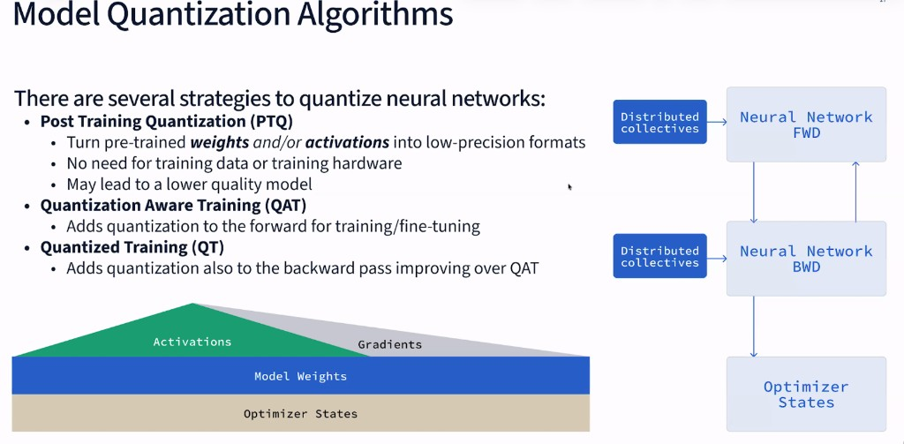

# Model Quantization



## Quantization Data Types

Floating-point numbers are stored using three components:

```
┌──────┬────────────┬─────────────────────┐
│ Sign │  Exponent  │      Mantissa       │
│ (1b) │  (range)   │    (precision)      │
└──────┴────────────┴─────────────────────┘
```

**Formula:** `value = (-1)^sign × 2^(exponent - bias) × (1 + mantissa)`

---

### Bit Layouts

```
FP32 (32 bits total)
├─┬────────┬───────────────────────┤
│S│  Exp   │       Mantissa        │
│1│   8    │          23           │
└─┴────────┴───────────────────────┘
Range: ±3.4 × 10³⁸  |  Precision: ~7 decimal digits


FP16 (16 bits total)
├─┬─────┬──────────┤
│S│ Exp │ Mantissa │
│1│  5  │    10    │
└─┴─────┴──────────┘
Range: ±65,504  |  Precision: ~3 decimal digits


BF16 (16 bits total) - "Brain Float"
├─┬────────┬───────┤
│S│  Exp   │ Mant  │
│1│   8    │   7   │
└─┴────────┴───────┘
Range: ±3.4 × 10³⁸ (same as FP32!)  |  Precision: ~2 decimal digits


FP8 E4M3 (8 bits total)
├─┬────┬─────┤
│S│Exp │Mant │
│1│ 4  │  3  │
└─┴────┴─────┘
Range: ±448  |  Precision: ~1 decimal digit


FP8 E5M2 (8 bits total)
├─┬─────┬────┤
│S│ Exp │Mant│
│1│  5  │ 2  │
└─┴─────┴────┘
Range: ±57,344  |  Precision: <1 decimal digit


FP4 / NVFP4 (4 bits total) - NVIDIA 4-bit float
├─┬────┬──┤
│S│Exp │M│
│1│ 2  │1│
└─┴────┴──┘
NVFP4: NVIDIA’s 4-bit floating-point format. Used on Blackwell (B200) Tensor Cores for inference;
reduces memory and increases throughput vs FP8, at lower precision. Typically 1 sign, 2 exponent, 1 mantissa bit.
```

---

### Comparison Table

| Format | Bits | Exponent | Mantissa | Range | Memory vs FP32 |
|--------|------|----------|----------|-------|----------------|
| FP32 | 32 | 8 | 23 | ±3.4×10³⁸ | 1× (baseline) |
| FP16 | 16 | 5 | 10 | ±65,504 | 0.5× |
| BF16 | 16 | 8 | 7 | ±3.4×10³⁸ | 0.5× |
| FP8 E4M3 | 8 | 4 | 3 | ±448 | 0.25× |
| FP8 E5M2 | 8 | 5 | 2 | ±57,344 | 0.25× |
| **FP4 / NVFP4** | 4 | 2 | 1 | narrow | 0.125× |

---

### Trade-offs

```
More Exponent Bits → Larger Range (bigger/smaller numbers)
More Mantissa Bits → Higher Precision (more decimal places)

FP32:  ████████ exp  ███████████████████████ mantissa  ← High precision
BF16:  ████████ exp  ███████ mantissa                  ← Same range as FP32, less precision
FP16:  █████ exp     ██████████ mantissa               ← Balanced
FP8:   ████ exp      ███ mantissa                      ← Compact, low precision
```

---

### Why BF16 is Popular for ML

- **Same dynamic range as FP32** (8-bit exponent)
- Handles large gradients during training
- Half the memory of FP32
- Hardware support on modern GPUs (A100, H100)

---

### Example: when to use which precision

Typical roles for different precisions in a layer or kernel:

| Stage | Use case | Precision | Reason |
|--------|----------|-----------|--------|
| **Input** | Model weights | FP8 / NVFP4 | Saves memory and bandwidth. |
| **Math** | Multiplication | FP8 | Extremely fast throughput. |
| **Math** | Summing (accumulation) | FP32 | Prevents rounding errors and “noise.” |
| **Output** | Final activation | BF16 / FP8 | Standardized for the next layer. |

---

### Memory Impact Example (Llama2 7B)

| Format | Memory Required |
|--------|-----------------|
| FP32 | ~28 GB |
| FP16/BF16 | ~14 GB |
| FP8 | ~7 GB |
| INT4 | ~3.5 GB |


