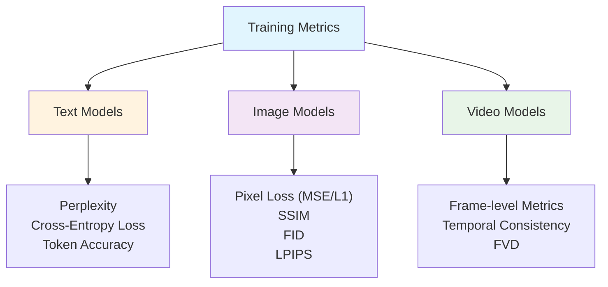
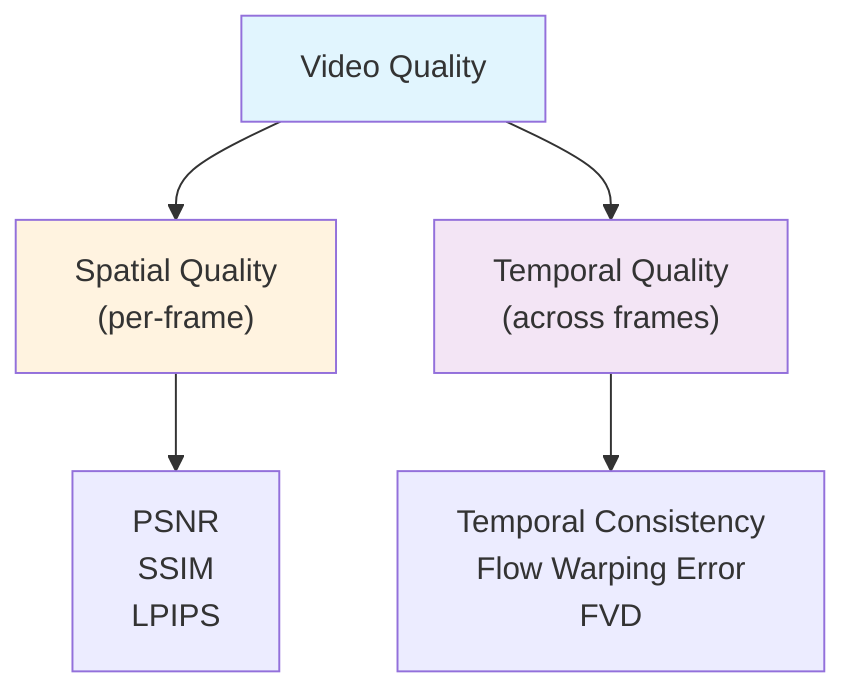
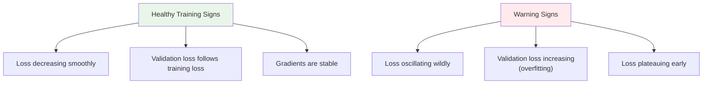

# Training Performance Metrics

This document covers how to measure and evaluate model performance during training. Different model types require different metrics—what works for text models often doesn't apply to video models and vice versa.

## Metrics by Model Type



---

## Text Model Metrics

### Perplexity

**Perplexity** is the most important metric for language models. It measures how "surprised" the model is by the actual next token—lower is better.

**Intuition**: If your model predicts the next word with high confidence and is correct, perplexity is low. If the model spreads probability across many wrong options, perplexity is high.

```
Perplexity = exp(Cross-Entropy Loss)
```

| Perplexity | Interpretation |
|------------|----------------|
| 1 | Perfect—model predicts every token with 100% confidence |
| 10 | Model is as confused as choosing from 10 equally likely words |
| 100 | Model is as confused as choosing from 100 equally likely words |
| 1000+ | Model is struggling significantly |

**Typical values** (for reference):
- State-of-the-art LLMs on common benchmarks: 5-20
- GPT-2 on WikiText-103: ~18
- Poorly trained models: 100+

> ⚠️ **Important Limitation**: Since perplexity measures token probabilities on logits, it is **NOT suitable for evaluating decoding tasks** like text generation or machine translation. It is designed to evaluate the logits of generative language models during training, not their generated outputs.

---

### Calculating Perplexity in PyTorch

In PyTorch, perplexity is calculated by taking the exponential of the cross-entropy loss. Since `CrossEntropyLoss` uses the natural logarithm (base e) internally, you apply `torch.exp()` to your average loss value.

#### Method 1: Using the Loss Value Manually

The most common and straightforward approach during training:

```python
import torch
import math

# Inside training loop, accumulate loss
total_loss = 0.0
total_tokens = 0

for batch in dataloader:
    outputs = model(inputs)
    loss = criterion(outputs, targets)
    
    # Accumulate loss weighted by token count
    total_loss += loss.item() * targets.numel()
    total_tokens += targets.numel()
    
    # ... backprop and optimization ...

# After epoch: calculate metrics
mean_loss = total_loss / total_tokens
perplexity = math.exp(mean_loss)

print(f"Mean Loss: {mean_loss:.4f}, Perplexity: {perplexity:.2f}")
```

> ⚠️ **Important**: Use the mean loss over all tokens/batches, not the sum or individual batch losses. This ensures proper averaging across variable-length sequences.

---

#### Method 2: Using torchmetrics Library

For larger projects or PyTorch Lightning, `torchmetrics` provides a built-in `Perplexity` metric with automatic accumulation and distributed training support:

```python
from torchmetrics.text import Perplexity
import torch

# Initialize metric (use ignore_index for padding tokens)
perplexity_metric = Perplexity(ignore_index=tokenizer.pad_token_id)

# During training loop
for batch in dataloader:
    logits = model(inputs)  # shape: [batch_size, seq_len, vocab_size]
    targets = batch['labels']  # shape: [batch_size, seq_len]
    
    # CRITICAL: For causal LMs, shift logits and targets!
    # Remove last token from logits, first token from targets
    shifted_logits = logits[:, :-1]
    shifted_targets = targets[:, 1:]
    
    # Update metric with shifted sequences
    perplexity_metric.update(shifted_logits, shifted_targets)

# After epoch
final_ppl = perplexity_metric.compute()
print(f"Training Perplexity: {final_ppl.item():.2f}")

# Reset for next epoch
perplexity_metric.reset()
```

> ⚠️ **Critical: Label Shifting for Causal Language Models**
> 
> For autoregressive models (GPT, LLaMA, etc.), the logits at position `i` predict the token at position `i+1`. You **must** shift the sequences:
> - `logits[:, :-1]` — predictions for positions 0 to N-1
> - `targets[:, 1:]` — actual tokens at positions 1 to N
> 
> Without this shift, perplexity will be **dramatically inflated** (e.g., 1929 instead of 227 in one example).

**Advantages of torchmetrics**:
- Handles accumulation automatically
- Syncs across distributed processes
- Cleaner code structure
- Proper handling of padding tokens via `ignore_index`

---

#### Padding Token Impact

Failing to ignore padding tokens causes massive perplexity inflation:

```python
# Example from torchmetrics documentation
perplexity_with_padding = Perplexity(ignore_index=None)
perplexity_no_padding = Perplexity(ignore_index=tokenizer.pad_token_id)

# Same model, same input:
# With padding included:    24,400  ❌ Misleading!
# With padding ignored:        227  ✅ Accurate
```

Always set `ignore_index=tokenizer.pad_token_id` when using padded sequences.

---

#### Complete Example with GPT-2

A full working example evaluating perplexity on a pretrained model:

```python
import torch
from transformers import AutoModelForCausalLM, AutoTokenizer
from torchmetrics.text import Perplexity

# Load model and tokenizer
model = AutoModelForCausalLM.from_pretrained("gpt2")
tokenizer = AutoTokenizer.from_pretrained("gpt2")

# Sample text
text = "The quick brown fox jumps over the lazy dog"
input_ids = tokenizer.encode(text, return_tensors="pt")

# Get logits
with torch.no_grad():
    outputs = model(input_ids, labels=input_ids)
logits = outputs.logits

# Calculate perplexity with proper shifting
perplexity = Perplexity()
score = perplexity(preds=logits[:, :-1], target=input_ids[:, 1:])
print(f"Perplexity: {score.item():.2f}")

# Verify: should match exp(loss) from model output
assert torch.allclose(outputs.loss.exp(), score)
```

---

### Cross-Entropy Loss

The foundation of perplexity—directly measures the difference between predicted probability distribution and actual tokens.

```
Cross-Entropy = -Σ y_true · log(y_pred)
```

For language modeling (single correct token per position):

```
Loss = -log(P(correct_token))
```

| Loss Value | Perplexity | Interpretation |
|------------|------------|----------------|
| 0 | 1 | Perfect prediction |
| 2.3 | ~10 | Reasonable |
| 4.6 | ~100 | Struggling |
| 6.9 | ~1000 | Very poor |

---

### Token Accuracy

Simple but useful—what fraction of predicted tokens match the ground truth?

```python
correct = (predicted_tokens == target_tokens).sum()
accuracy = correct / total_tokens
```

**Limitation**: Doesn't capture how close wrong predictions were. A model predicting "cat" when the answer is "dog" scores the same as one predicting "xyzzy".

> 📚 **Reference**: For more details on the torchmetrics Perplexity implementation, see the [official documentation](https://lightning.ai/docs/torchmetrics/stable/gallery/text/perplexity.html).

---

## Video Model Metrics

Video models require metrics that capture both **spatial quality** (individual frames) and **temporal consistency** (motion coherence).



---

### Fréchet Video Distance (FVD)

**The primary metric for video generation quality**—analogous to FID for images but extended to video.

**How it works**:
1. Extract features from real and generated videos using a pretrained video model (I3D)
2. Model both feature distributions as Gaussians
3. Compute Fréchet distance between distributions

```
FVD = ||μ_real - μ_gen||² + Tr(Σ_real + Σ_gen - 2(Σ_real·Σ_gen)^0.5)
```

| FVD Range | Interpretation |
|-----------|----------------|
| < 100 | Excellent quality |
| 100-300 | Good quality |
| 300-500 | Moderate quality |
| > 500 | Poor quality |

---

### Temporal Consistency Metrics

#### Flow Warping Error

Measures whether generated frames are temporally coherent by:
1. Computing optical flow between consecutive frames
2. Warping one frame to the next using the flow
3. Measuring reconstruction error

```python
# Conceptual implementation
flow = compute_optical_flow(frame_t, frame_t1)
warped = warp(frame_t, flow)
warping_error = mse(warped, frame_t1)
```

#### Temporal Cosine Similarity

Compares feature representations across consecutive frames:

```python
# Using pretrained features
features_t = encoder(frame_t)
features_t1 = encoder(frame_t1)
temporal_consistency = cosine_similarity(features_t, features_t1)
```

---

### Per-Frame Quality Metrics

These image metrics are applied to individual video frames:

| Metric | Description | Range | Text Models | Video Models |
|--------|-------------|-------|-------------|--------------|
| **PSNR** | Peak Signal-to-Noise Ratio (pixel-level) | Higher is better (30+ dB good) | ❌ | ✅ |
| **SSIM** | Structural Similarity Index | 0-1 (higher better) | ❌ | ✅ |
| **LPIPS** | Learned Perceptual Image Patch Similarity | Lower is better | ❌ | ✅ |
| **FID** | Fréchet Inception Distance (per-frame) | Lower is better | ❌ | ✅ |

---

## Comparison: Text vs Video Metrics

| Metric | Text Models | Video Models | Why |
|--------|-------------|--------------|-----|
| **Perplexity** | ✅ Primary | ❌ Not applicable | Only meaningful for discrete token prediction |
| **Cross-Entropy** | ✅ Primary | ⚠️ Sometimes | Video models may use different loss functions |
| **FVD** | ❌ Not applicable | ✅ Primary | Requires visual feature distributions |
| **PSNR/SSIM** | ❌ Not applicable | ✅ Common | Pixel-level reconstruction quality |
| **LPIPS** | ❌ Not applicable | ✅ Common | Perceptual quality measurement |
| **Temporal Consistency** | ❌ Not applicable | ✅ Critical | Video-specific: motion coherence |
| **Token Accuracy** | ✅ Useful | ❌ Not applicable | Only for discrete sequences |

---

## Training Loss Curves

Regardless of model type, monitoring training dynamics is essential:



### What to Watch For

| Symptom | Likely Cause | Solution |
|---------|-------------|----------|
| Loss explodes (NaN/Inf) | Learning rate too high | Reduce LR, add gradient clipping |
| Loss decreases then plateaus | Stuck in local minimum | LR scheduler, increase batch size |
| Training loss low, validation high | Overfitting | Regularization, more data, early stopping |
| Loss oscillates | LR too high or batch too small | Reduce LR, increase batch size |
| Loss doesn't decrease | LR too low or architecture issue | Increase LR, check gradients |

---

## Practical Implementation

### Logging Best Practices

```python
import wandb  # or tensorboard, mlflow, etc.

# Log multiple metrics per step
wandb.log({
    "train/loss": loss.item(),
    "train/perplexity": math.exp(loss.item()),
    "train/learning_rate": scheduler.get_last_lr()[0],
    "train/gradient_norm": grad_norm,
    "epoch": epoch,
    "step": global_step
})

# For video models, add:
wandb.log({
    "train/fvd": fvd_score,
    "train/temporal_consistency": temporal_score,
    "train/psnr": psnr_value,
})
```

### Metric Checkpointing

```python
best_metric = float('inf')  # for perplexity/loss (lower is better)

if current_metric < best_metric:
    best_metric = current_metric
    torch.save({
        'model_state_dict': model.state_dict(),
        'optimizer_state_dict': optimizer.state_dict(),
        'metric': best_metric,
        'epoch': epoch
    }, 'best_model.pt')
```

---

## Summary

| Model Type | Primary Metric | Secondary Metrics | Key Insight |
|------------|---------------|-------------------|-------------|
| **Text/LLM** | Perplexity | Cross-entropy, Token accuracy | Lower perplexity = better next-token prediction |
| **Image** | FID | LPIPS, SSIM, PSNR | Balance perceptual and pixel-level quality |
| **Video** | FVD | Temporal consistency, Per-frame FID | Must capture both spatial AND temporal quality |

> **Key Takeaway**: Always choose metrics that match your model's output type. Perplexity is meaningless for video models, and FVD is meaningless for language models. Use the right tool for the job.

