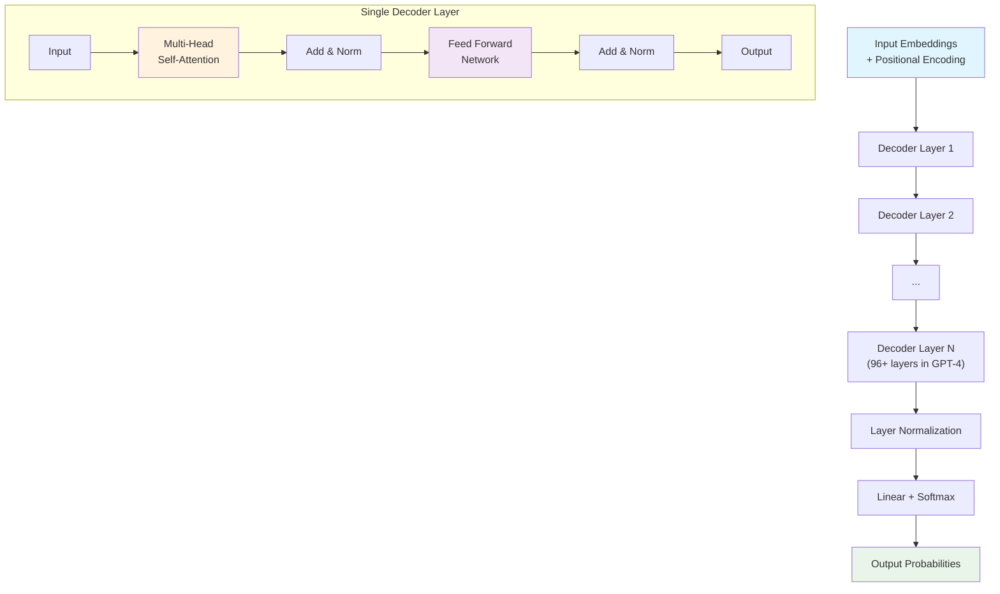

# Transformer Architecture Explained

This document explains the Transformer architecture, the foundation of modern language models like ChatGPT.

## Overview

The Transformer is a neural network architecture that revolutionized natural language processing by replacing recurrent layers with self-attention mechanisms, enabling parallel processing and better handling of long sequences.

## Transformer Decoder Architecture



## Key Components

### **1. Decoder Layers**
- Stack of identical layers (typically 12-96+ layers)
- Each layer has two main sub-components
- Residual connections around each sub-layer
- Layer normalization for training stability

### **2. Multi-Head Self-Attention**
- Core innovation of the Transformer
- Allows model to focus on different parts of input
- Multiple attention heads capture different relationships
- Enables parallel processing unlike RNNs

### **3. Feed Forward Networks**
- Position-wise fully connected layers
- Two linear transformations with ReLU activation
- Same across all positions but different across layers
- Typically 4x larger than model dimension

### **4. Residual Connections**
- Skip connections around each sub-layer
- Helps with gradient flow in deep networks
- Formula: `output = LayerNorm(x + Sublayer(x))`

### **5. Layer Normalization**
- Normalizes inputs across features
- Applied before each sub-layer (Pre-LN) in modern variants
- Stabilizes training and improves convergence

## Mathematical Flow

```
For each decoder layer:

1. Self-Attention:
   x' = x + MultiHeadAttention(LayerNorm(x))

2. Feed Forward:
   x'' = x' + FeedForward(LayerNorm(x'))

Where:
- x: input to the layer
- LayerNorm: layer normalization
- MultiHeadAttention: multi-head self-attention
- FeedForward: position-wise feed forward network
```

## Autoregressive Generation

### **Causal Masking**
- Prevents model from seeing future tokens
- Ensures left-to-right generation
- Implemented through attention masks

### **Generation Process**
1. Start with prompt tokens
2. Generate next token probability distribution
3. Sample or select most likely token
4. Add to sequence and repeat
5. Continue until end token or max length

## Scaling Properties

### **Model Size**
- **GPT-1**: 117M parameters, 12 layers
- **GPT-2**: 1.5B parameters, 48 layers  
- **GPT-3**: 175B parameters, 96 layers
- **GPT-4**: Estimated 1T+ parameters, 100+ layers

### **Scaling Laws**
- Performance improves predictably with scale
- More parameters → better performance
- More data → better performance
- More compute → better performance

## Training Process

### **Pre-training**
- Unsupervised learning on large text corpora
- Next token prediction objective
- Learns language patterns and world knowledge

### **Objective Function**
```
Loss = -∑ log P(token_i | token_1, ..., token_{i-1})
```

### **Optimization**
- Adam optimizer with learning rate scheduling
- Gradient clipping for stability
- Mixed precision training for efficiency

## Key Innovations

### **1. Self-Attention**
- Replaces recurrence with attention
- Enables parallel processing
- Better long-range dependencies

### **2. Positional Encoding**
- Injects sequence order information
- Sinusoidal or learned embeddings
- Essential since attention is permutation-invariant

### **3. Residual Connections**
- Enables training of very deep networks
- Helps gradient flow
- Prevents vanishing gradients

### **4. Layer Normalization**
- Stabilizes training
- Reduces internal covariate shift
- Enables deeper networks

## Advantages

### **Parallelization**
- All positions processed simultaneously
- Much faster training than RNNs
- Better GPU utilization

### **Long-Range Dependencies**
- Direct connections between all positions
- No information bottleneck
- Better context understanding

### **Transfer Learning**
- Pre-trained models transfer well
- Fine-tuning for specific tasks
- Few-shot and zero-shot capabilities

## Limitations

### **Computational Complexity**
- Quadratic complexity in sequence length
- Memory requirements grow quickly
- Expensive for very long sequences

### **Inductive Biases**
- Less built-in structure than CNNs/RNNs
- Requires more data to learn patterns
- May struggle with systematic generalization

## Modern Variants

### **Decoder-Only Models**
- GPT series, PaLM, LaMDA
- Autoregressive generation
- Strong few-shot learning

### **Encoder-Decoder Models**
- T5, BART, UL2
- Good for conditional generation
- Translation, summarization

### **Encoder-Only Models**
- BERT, RoBERTa, DeBERTa
- Bidirectional context
- Classification and understanding tasks

## Implementation Considerations

### **Memory Optimization**
- Gradient checkpointing
- Mixed precision training
- Model parallelism for large models

### **Training Efficiency**
- Learning rate warmup
- Gradient clipping
- Batch size scaling

### **Inference Optimization**
- KV-cache for generation
- Quantization techniques
- Pruning and distillation
